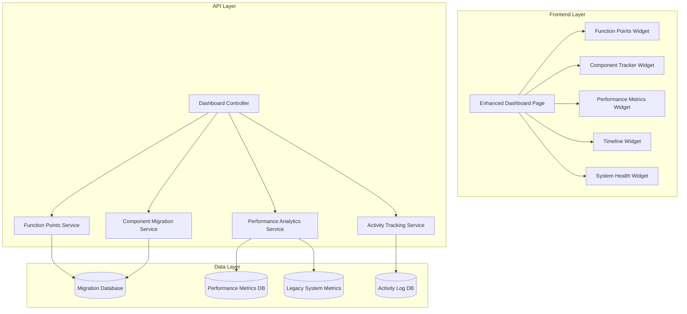

# Design Document

## Overview

This design document outlines the enhancement of the existing Caixa Seguradora migration dashboard to provide comprehensive visibility into the Visual Age to .NET 9 migration project. The enhanced dashboard will integrate function point analysis, detailed component tracking, performance metrics, and real-time project status monitoring.

The design builds upon the existing dashboard infrastructure, including React components, API endpoints, and data models already implemented in the project.

## Architecture

### System Architecture



### Enhanced Dashboard Layout

The dashboard will follow a card-based layout with the following sections:

1. **Header Section**: Caixa Seguradora branding and navigation
2. **Overview Cards**: Key metrics summary (4 cards)
3. **Function Points Analysis**: Detailed breakdown with complexity distribution
4. **Component Migration Grid**: Visual status of all 57 components
5. **Performance Comparison**: Legacy vs New system metrics
6. **Project Timeline**: Milestone tracking and velocity analysis
7. **Activities Feed**: Real-time project updates
8. **System Health**: External services and infrastructure status

## Components and Interfaces

### Enhanced Frontend Components

#### 1. FunctionPointsWidget Component

```typescript
interface FunctionPointsData {
  totalPoints: number;
  migratedPoints: number;
  remainingPoints: number;
  complexityDistribution: {
    simple: { total: number; migrated: number; };
    average: { total: number; migrated: number; };
    complex: { total: number; migrated: number; };
  };
  estimatedEffort: {
    totalHours: number;
    actualHours: number;
    remainingHours: number;
    velocityTrend: number[];
  };
}
```

#### 2. ComponentMigrationGrid Component

```typescript
interface ComponentGridData {
  components: ComponentDetail[];
  summary: {
    screens: ComponentTypeStats;
    businessRules: ComponentTypeStats;
    databaseEntities: ComponentTypeStats;
    externalServices: ComponentTypeStats;
  };
  filters: {
    status: ComponentStatus[];
    complexity: ComplexityLevel[];
    assignee: string[];
  };
}
```

#### 3. PerformanceComparisonChart Component

```typescript
interface PerformanceData {
  metrics: PerformanceMetric[];
  trends: {
    responseTime: TrendData[];
    throughput: TrendData[];
    errorRate: TrendData[];
    memoryUsage: TrendData[];
  };
  benchmarks: {
    target: number;
    current: number;
    legacy: number;
  };
}
```

#### 4. ProjectTimelineWidget Component

```typescript
interface TimelineData {
  milestones: Milestone[];
  userStories: UserStoryStatus[];
  velocity: {
    sprintVelocity: number[];
    burndownChart: BurndownPoint[];
    predictedCompletion: Date;
  };
  risks: RiskIndicator[];
}
```

### Enhanced API Endpoints

#### 1. Function Points Analysis Endpoint

```
GET /api/dashboard/function-points
```

**Response Schema:**
```json
{
  "sucesso": true,
  "analiseCompleta": {
    "totalPontosFuncao": 847,
    "pontosMigrados": 556,
    "pontosRestantes": 291,
    "percentualCompleto": 65.7,
    "distribuicaoComplexidade": {
      "simples": { "total": 312, "migrados": 298, "percentual": 95.5 },
      "media": { "total": 389, "migrados": 201, "percentual": 51.7 },
      "complexa": { "total": 146, "migrados": 57, "percentual": 39.0 }
    },
    "esforcoEstimado": {
      "horasTotais": 3388,
      "horasRealizadas": 2234,
      "horasRestantes": 1154,
      "velocidadeMedia": 42.5,
      "tendenciaVelocidade": [38, 41, 44, 42, 45, 43]
    }
  }
}
```

#### 2. Enhanced Component Details Endpoint

```
GET /api/dashboard/components/detailed
```

**Response includes:**
- Function point allocation per component
- Effort estimation vs actual
- Dependency mapping
- Risk assessment
- Blocking issues tracking

#### 3. Performance Analytics Endpoint

```
GET /api/dashboard/performance/analytics
```

**Response includes:**
- Historical performance trends
- Benchmark comparisons
- Performance regression detection
- Capacity planning metrics

### Data Models

#### 1. Enhanced Component Model

```csharp
public class EnhancedComponentDetail
{
    public string Id { get; set; }
    public string UserStoryId { get; set; }
    public ComponentType Type { get; set; }
    public string Name { get; set; }
    public string LegacyReference { get; set; }
    public ComponentStatus Status { get; set; }
    
    // Function Points Analysis
    public int FunctionPoints { get; set; }
    public ComplexityLevel Complexity { get; set; }
    public decimal EstimatedHours { get; set; }
    public decimal ActualHours { get; set; }
    
    // Dependencies and Risks
    public List<string> Dependencies { get; set; }
    public List<RiskFactor> Risks { get; set; }
    public List<BlockingIssue> BlockingIssues { get; set; }
    
    // Progress Tracking
    public DateTime StartDate { get; set; }
    public DateTime? CompletionDate { get; set; }
    public string Assignee { get; set; }
    public string TechnicalNotes { get; set; }
}
```

#### 2. Function Points Analysis Model

```csharp
public class FunctionPointsAnalysis
{
    public int TotalFunctionPoints { get; set; }
    public int MigratedFunctionPoints { get; set; }
    public decimal CompletionPercentage { get; set; }
    
    public ComplexityDistribution Distribution { get; set; }
    public EffortAnalysis Effort { get; set; }
    public VelocityTrend Velocity { get; set; }
}

public class ComplexityDistribution
{
    public ComplexityStats Simple { get; set; }
    public ComplexityStats Average { get; set; }
    public ComplexityStats Complex { get; set; }
}

public class ComplexityStats
{
    public int Total { get; set; }
    public int Migrated { get; set; }
    public decimal Percentage { get; set; }
}
```

#### 3. Enhanced Performance Metrics Model

```csharp
public class EnhancedPerformanceMetric
{
    public string MetricType { get; set; }
    public string Name { get; set; }
    public decimal LegacyValue { get; set; }
    public decimal NewValue { get; set; }
    public decimal ImprovementPercentage { get; set; }
    public string Unit { get; set; }
    
    // Trend Analysis
    public List<TrendPoint> HistoricalTrend { get; set; }
    public decimal TargetValue { get; set; }
    public bool MeetsBenchmark { get; set; }
    
    // Test Context
    public string TestScenario { get; set; }
    public DateTime MeasurementDate { get; set; }
    public string Environment { get; set; }
}
```

## Error Handling

### Enhanced Error Scenarios

1. **Function Points Calculation Errors**
   - Missing component complexity data
   - Invalid effort estimation parameters
   - Velocity calculation failures

2. **Performance Metrics Errors**
   - Legacy system unavailable for comparison
   - Incomplete performance data
   - Benchmark threshold violations

3. **Real-time Data Sync Errors**
   - Dashboard refresh failures
   - WebSocket connection issues
   - Data consistency problems

### Error Response Enhancement

```json
{
  "sucesso": false,
  "codigoErro": "DASHBOARD_METRICS_UNAVAILABLE",
  "mensagem": "Métricas de performance temporariamente indisponíveis",
  "detalhes": [
    "Sistema legado não responsivo para comparação",
    "Usando dados em cache dos últimos 30 minutos"
  ],
  "acoesSugeridas": [
    "Verificar conectividade com sistema legado",
    "Consultar métricas históricas como alternativa"
  ],
  "timestamp": "2025-10-23T14:30:00Z",
  "impactoFuncionalidade": "Parcial"
}
```

## Testing Strategy

### Unit Testing

1. **Component Testing**
   - Function points calculation logic
   - Performance metrics aggregation
   - Dashboard widget rendering
   - Data transformation utilities

2. **Service Testing**
   - API endpoint responses
   - Data validation rules
   - Error handling scenarios
   - Cache management

### Integration Testing

1. **Dashboard Integration**
   - End-to-end dashboard loading
   - Real-time data updates
   - Cross-component communication
   - Performance under load

2. **API Integration**
   - Database query performance
   - External service connectivity
   - Data consistency validation
   - Error propagation

### Performance Testing

1. **Dashboard Performance**
   - Page load times under various data volumes
   - Real-time update responsiveness
   - Memory usage optimization
   - Concurrent user handling

2. **API Performance**
   - Response time benchmarks
   - Throughput capacity
   - Database query optimization
   - Caching effectiveness

### User Acceptance Testing

1. **Stakeholder Scenarios**
   - Project manager daily review workflow
   - Technical lead component tracking
   - Executive summary generation
   - Risk identification and escalation

2. **Usability Testing**
   - Dashboard navigation efficiency
   - Information findability
   - Visual clarity and comprehension
   - Mobile responsiveness

## Implementation Phases

### Phase 1: Function Points Integration
- Implement function points calculation service
- Create FunctionPointsWidget component
- Add function points data to existing API endpoints
- Update database schema for function points tracking

### Phase 2: Enhanced Component Tracking
- Extend ComponentDetail model with effort and dependency data
- Implement enhanced component grid with filtering
- Add risk and blocking issue tracking
- Create component dependency visualization

### Phase 3: Advanced Performance Analytics
- Implement performance trend analysis
- Create comparative performance charts
- Add benchmark tracking and alerting
- Integrate with legacy system monitoring

### Phase 4: Real-time Enhancements
- Implement WebSocket for real-time updates
- Add auto-refresh optimization
- Create activity feed with live updates
- Implement dashboard personalization

### Phase 5: Reporting and Export
- Add dashboard export functionality
- Create automated report generation
- Implement stakeholder notification system
- Add historical data archiving