# Diagramas de Casos de Uso - SIWEA

## Diagrama Principal - Sistema Completo

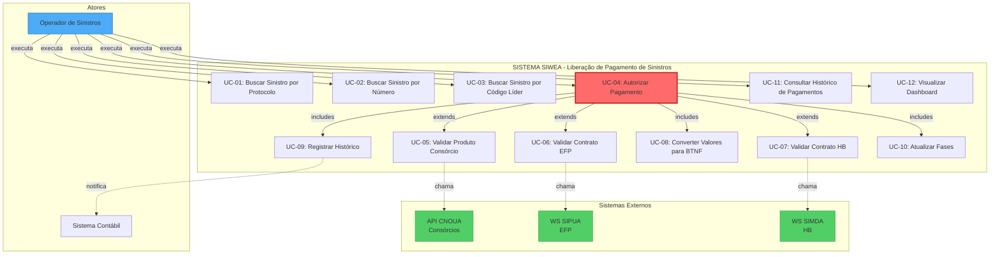

---

## UC-01: Buscar Sinistro por Protocolo

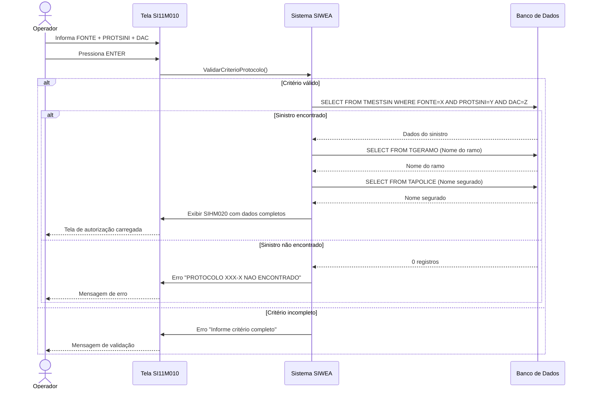

**Descrição:**
- **Ator Principal:** Operador de Sinistros
- **Pré-condição:** Operador autenticado no sistema
- **Pós-condição:** Sinistro localizado e tela SIHM020 exibida

**Fluxo Principal:**
1. Operador informa FONTE, PROTSINI e DAC
2. Sistema valida que todos os 3 campos foram preenchidos
3. Sistema consulta TMESTSIN usando os 3 campos
4. Sistema carrega dados complementares (ramo, segurado)
5. Sistema calcula saldo pendente (SDOPAG - TOTPAG)
6. Sistema exibe tela SIHM020 com dados do sinistro

**Fluxo Alternativo - Protocolo não encontrado:**
- 3a. Sistema não localiza registro
- 3b. Sistema exibe mensagem "PROTOCOLO XXX-X NAO ENCONTRADO"
- 3c. Operador pode tentar outro critério

**Regras de Negócio:**
- BR-001: Três critérios mutuamente exclusivos
- BR-002: Obrigatoriedade de critério completo
- BR-003: Recuperação de dados do registro mestre

---

## UC-02: Buscar Sinistro por Número

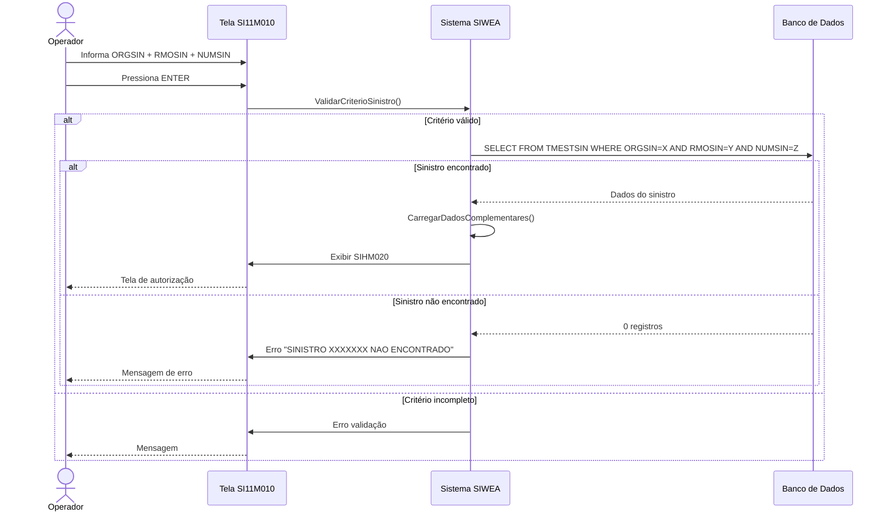

**Descrição:**
- **Ator Principal:** Operador de Sinistros
- **Pré-condição:** Operador autenticado
- **Pós-condição:** Sinistro localizado

**Fluxo Principal:**
1. Operador informa ORGSIN (2 dígitos), RMOSIN (2 dígitos), NUMSIN (6 dígitos)
2. Sistema valida formato e completude
3. Sistema consulta TMESTSIN pela chave composta
4. Sistema exibe dados do sinistro

**Validações:**
- ORGSIN: 01-99
- RMOSIN: 00-99
- NUMSIN: 000001-999999

---

## UC-03: Buscar Sinistro por Código Líder

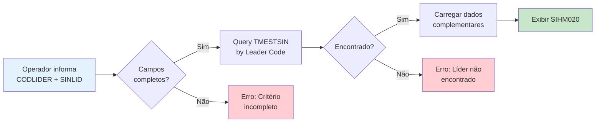

**Descrição:**
- **Ator Principal:** Operador de Sinistros
- **Objetivo:** Localizar sinistro por código de líder de resseguro

**Regra de Negócio Específica:**
- Este modo identifica sinistros de resseguro/líder
- CODLIDER: 3 dígitos (001-999)
- SINLID: 7 dígitos (0000001-9999999)

---

## UC-04: Autorizar Pagamento (Caso de Uso Principal)

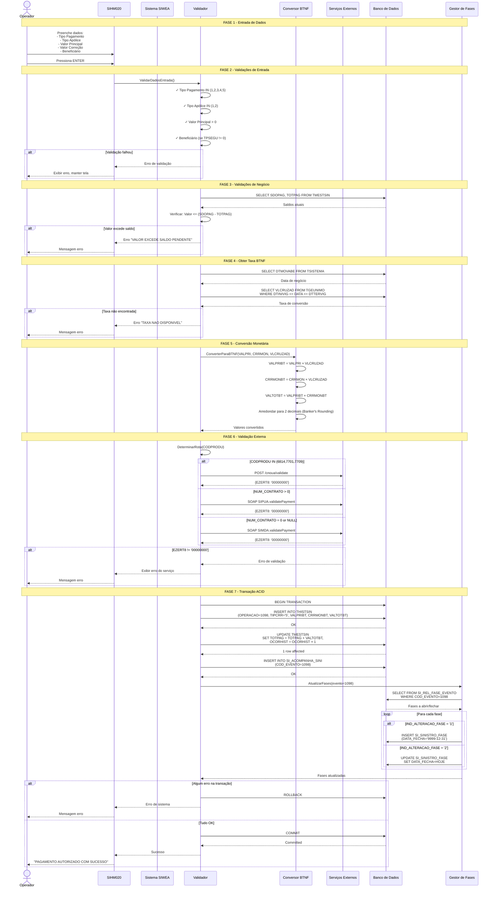

**Descrição Completa:**

**Atores:**
- **Principal:** Operador de Sinistros
- **Secundário:** Sistema Contábil (notificado após COMMIT)

**Pré-condições:**
1. Operador autenticado
2. Sinistro localizado via UC-01, UC-02 ou UC-03
3. Tela SIHM020 exibida com dados do sinistro

**Pós-condições (Sucesso):**
1. Registro inserido em THISTSIN
2. TMESTSIN.TOTPAG atualizado
3. TMESTSIN.OCORHIST incrementado
4. Registro inserido em SI_ACOMPANHA_SINI
5. Fases abertas/fechadas conforme configuração
6. Sistema contábil notificado

**Pós-condições (Falha):**
1. Nenhuma mudança persistida (ROLLBACK)
2. Mensagem de erro exibida ao operador
3. Log de auditoria registrado

**Fluxo Principal:**
1. Operador preenche dados de pagamento
2. Sistema valida entrada (tipo, formato, obrigatoriedade)
3. Sistema valida negócio (saldo disponível)
4. Sistema obtém data de negócio e taxa BTNF
5. Sistema calcula valores convertidos
6. Sistema determina rota de validação (CNOUA/SIPUA/SIMDA)
7. Sistema chama serviço externo de validação
8. Sistema inicia transação de banco de dados
9. Sistema insere histórico (THISTSIN)
10. Sistema atualiza sinistro mestre (TMESTSIN)
11. Sistema registra acompanhamento (SI_ACOMPANHA_SINI)
12. Sistema atualiza fases (SI_SINISTRO_FASE)
13. Sistema comita transação
14. Sistema exibe mensagem de sucesso

**Fluxos Alternativos:**

**A1: Validação de entrada falha**
- Sistema exibe erro específico
- Operador corrige e reenvia

**A2: Valor excede saldo pendente**
- Sistema exibe "VALOR EXCEDE SALDO PENDENTE"
- Operador reduz valor ou cancela

**A3: Taxa BTNF não disponível**
- Sistema exibe "TAXA DE CONVERSAO NAO DISPONIVEL PARA A DATA"
- Operador contacta suporte técnico

**A4: Validação externa falha**
- Sistema exibe código EZERT8 e mensagem do serviço
- Operador verifica dados do sinistro/contrato

**A5: Timeout serviço externo**
- Sistema tenta retry (2 vezes)
- Se falha persistente: Circuit breaker abre
- Sistema exibe "SERVICO DE VALIDACAO INDISPONIVEL"

**A6: Erro na transação de banco**
- Sistema executa ROLLBACK total
- Sistema registra log de erro
- Sistema exibe "ERRO AO PROCESSAR PAGAMENTO"
- Operador pode tentar novamente

**Regras de Negócio Aplicadas:**
- BR-010 a BR-022: Autorização de Pagamento
- BR-023 a BR-033: Conversão Monetária
- BR-034 a BR-042: Registro de Transações
- BR-043 a BR-056: Validação de Produtos
- BR-057 a BR-067: Gestão de Fases
- BR-068 a BR-074: Auditoria

**Requisitos Não-Funcionais:**
- **Performance:** Ciclo completo < 90 segundos
- **Timeout:** Validação externa = 10 segundos
- **Retry:** 2 tentativas com backoff exponencial
- **Isolamento:** READ COMMITTED
- **Disponibilidade:** Circuit breaker após 5 falhas consecutivas

---

## UC-05: Validar Produto Consórcio (CNOUA)

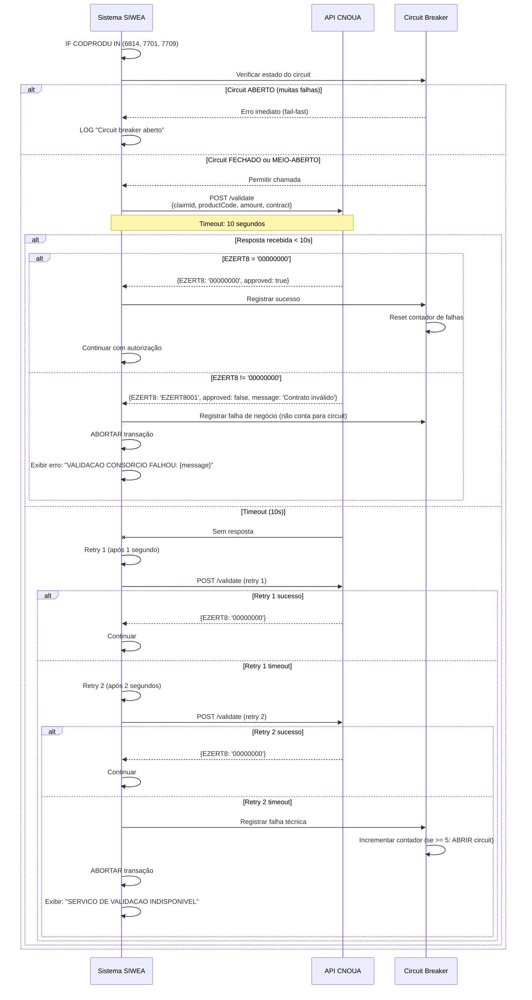

**Descrição:**
- **Trigger:** CODPRODU IN (6814, 7701, 7709)
- **Timeout:** 10 segundos por tentativa
- **Retries:** 2 tentativas (backoff: 1s, 2s)
- **Circuit Breaker:** Abre após 5 falhas consecutivas, fecha após 60s

**Códigos de Resposta CNOUA:**
- `00000000`: Validação bem-sucedida
- `EZERT8001`: Contrato de consórcio inválido
- `EZERT8002`: Contrato cancelado
- `EZERT8003`: Grupo fechado
- `EZERT8004`: Cota não contemplada
- `EZERT8005`: Beneficiário não autorizado

---

## UC-06: Validar Contrato EFP (SIPUA)

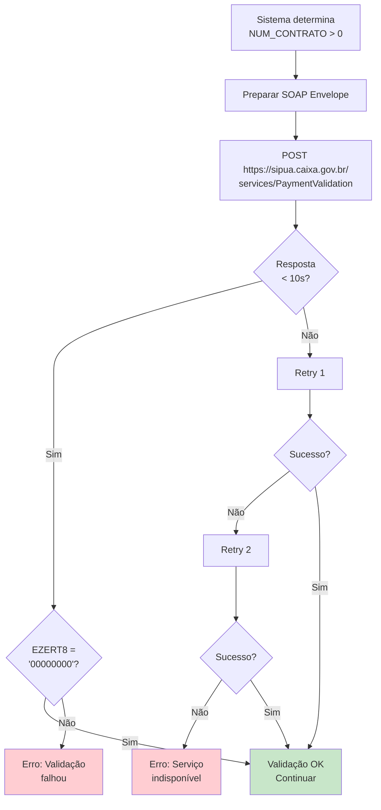

**Descrição:**
- **Trigger:** NUM_CONTRATO > 0 (produto não-consórcio)
- **Protocolo:** SOAP 1.2
- **Endpoint:** https://sipua.caixa.gov.br/services/PaymentValidation?wsdl

**Request SOAP:**
```xml
<soapenv:Envelope xmlns:soapenv="http://schemas.xmlsoap.org/soap/envelope/"
                  xmlns:pay="http://caixa.gov.br/sipua/payment/v1">
  <soapenv:Body>
    <pay:validatePaymentRequest>
      <pay:policyNumber>001/0123456</pay:policyNumber>
      <pay:contractNumber>12345</pay:contractNumber>
      <pay:amount>25000.00</pay:amount>
      <pay:transactionDate>2024-10-27</pay:transactionDate>
    </pay:validatePaymentRequest>
  </soapenv:Body>
</soapenv:Envelope>
```

---

## UC-07: Validar Contrato HB (SIMDA)

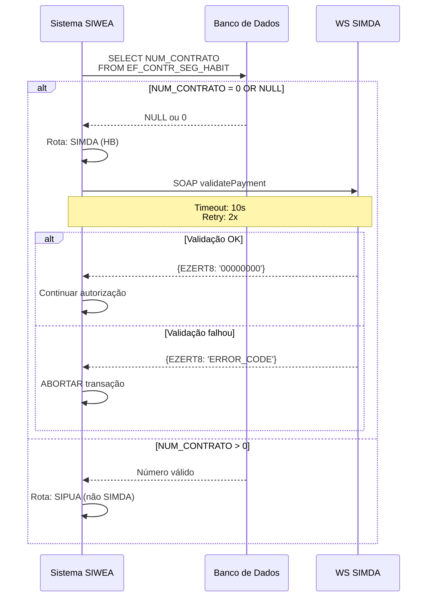

**Descrição:**
- **Trigger:** NUM_CONTRATO = 0 ou NULL
- **Protocolo:** SOAP 1.2
- **Endpoint:** https://simda.caixa.gov.br/services/HBValidation?wsdl

---

## UC-08: Converter Valores para BTNF

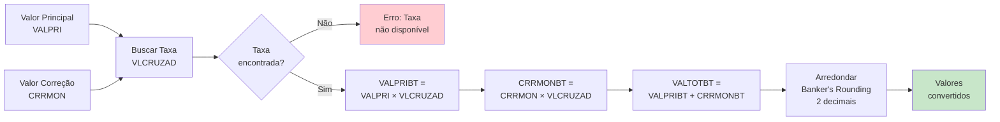

**Descrição:**
- **Entrada:** VALPRI (Decimal 15,2), CRRMON (Decimal 15,2)
- **Taxa:** VLCRUZAD (Decimal 18,8) de TGEUNIMO
- **Saída:** VALPRIBT, CRRMONBT, VALTOTBT (Decimal 15,2)

**Fórmulas:**
```
VALPRIBT = VALPRI × VLCRUZAD
CRRMONBT = CRRMON × VLCRUZAD
VALTOTBT = VALPRIBT + CRRMONBT
```

**Arredondamento:**
- Método: Banker's Rounding (IEEE 754)
- Casas decimais: 2
- Exemplos:
  - 12.345 → 12.34
  - 12.355 → 12.36
  - 12.365 → 12.36

---

## UC-09: Registrar Histórico

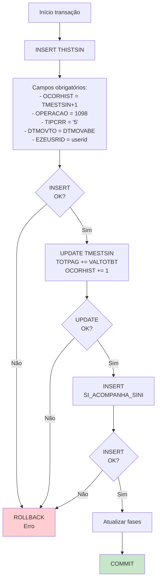

**Descrição:**
- **Tabelas afetadas:** THISTSIN, TMESTSIN, SI_ACOMPANHA_SINI, SI_SINISTRO_FASE
- **Tipo:** Transação ACID (all-or-nothing)

**Valores fixos:**
- OPERACAO = 1098 (código de autorização)
- TIPCRR = '5' (tipo de correção padrão)
- SITCONTB = '0' (situação contábil inicial)
- SITUACAO = '0' (situação geral inicial)

---

## UC-10: Atualizar Fases

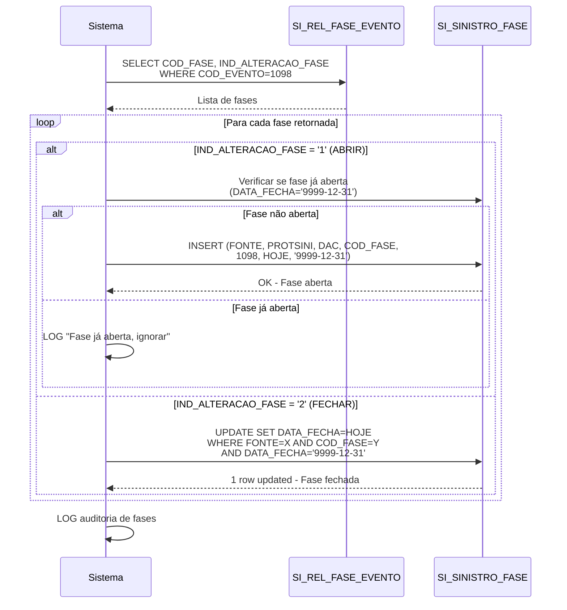

**Descrição:**
- **Configuração:** Tabela SI_REL_FASE_EVENTO define quais fases abrir/fechar para cada evento
- **Sentinel:** '9999-12-31' indica fase aberta
- **Evento 1098:** Tipicamente abre fase 10 (Pagamento) e fecha fase 5 (Documentação)

---

## UC-11: Consultar Histórico de Pagamentos

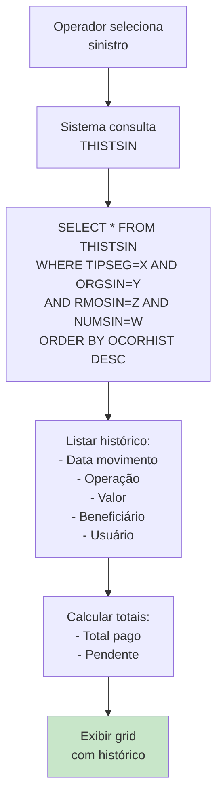

**Descrição:**
- **Ordenação:** Decrescente por OCORHIST (mais recente primeiro)
- **Filtros:** Por sinistro (chave 4 partes)
- **Campos exibidos:**
  - Data movimento (DTMOVTO)
  - Tipo operação (OPERACAO)
  - Valor total BTNF (VALTOTBT)
  - Beneficiário (NOMFAV)
  - Usuário (EZEUSRID)

---

## UC-12: Visualizar Dashboard

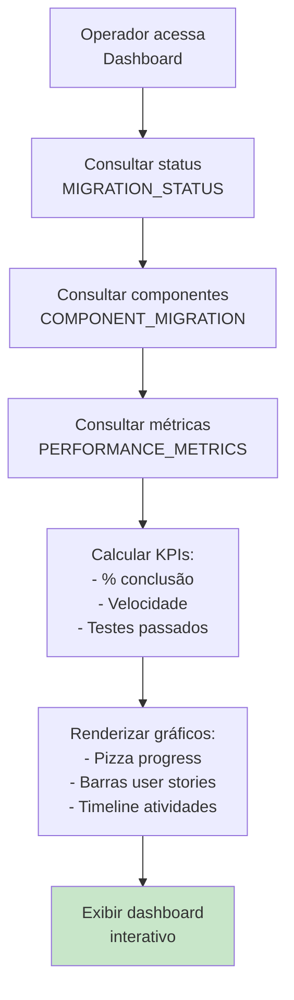

**Descrição:**
- **Dados exibidos:**
  - Progresso geral do projeto
  - Status de user stories (6 stories)
  - Componentes migrados (telas, regras, entidades)
  - Métricas de performance (Visual Age vs .NET)
  - Timeline de atividades recentes

**Atualização:** Refresh automático a cada 30 segundos

---

## Resumo de Casos de Uso

| UC | Nome | Ator | Complexidade | Prioridade |
|----|------|------|--------------|------------|
| UC-01 | Buscar Sinistro por Protocolo | Operador | Baixa | Alta |
| UC-02 | Buscar Sinistro por Número | Operador | Baixa | Alta |
| UC-03 | Buscar Sinistro por Código Líder | Operador | Baixa | Média |
| UC-04 | Autorizar Pagamento | Operador | **Alta** | **Crítica** |
| UC-05 | Validar Produto Consórcio | Sistema | Média | Alta |
| UC-06 | Validar Contrato EFP | Sistema | Média | Alta |
| UC-07 | Validar Contrato HB | Sistema | Média | Alta |
| UC-08 | Converter Valores BTNF | Sistema | Baixa | Alta |
| UC-09 | Registrar Histórico | Sistema | Média | Crítica |
| UC-10 | Atualizar Fases | Sistema | Média | Alta |
| UC-11 | Consultar Histórico | Operador | Baixa | Média |
| UC-12 | Visualizar Dashboard | Operador | Baixa | Baixa |

---

## Matriz de Dependências

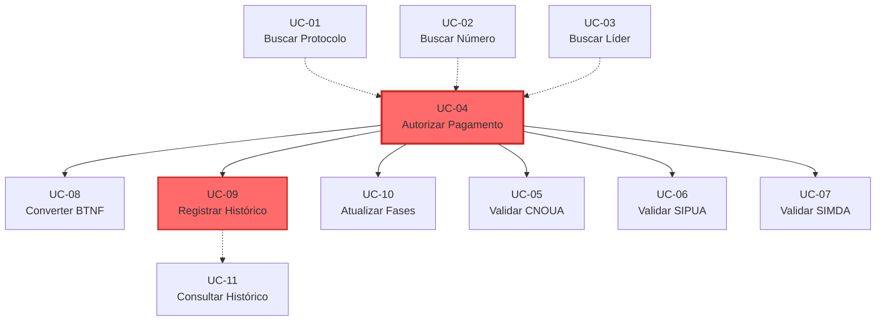

**Legenda:**
- Linha sólida (→): `includes` ou dependência obrigatória
- Linha tracejada (-.->): `extends` ou dependência opcional
- Cor vermelha: Casos de uso críticos

---

**FIM DO DOCUMENTO - CASOS DE USO**
