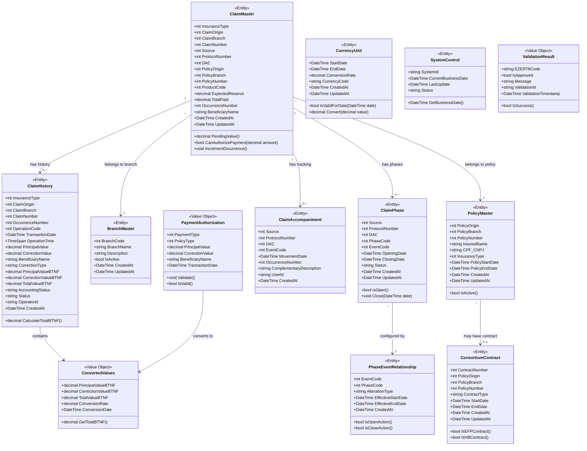
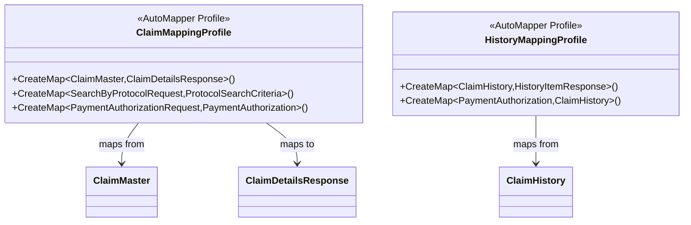
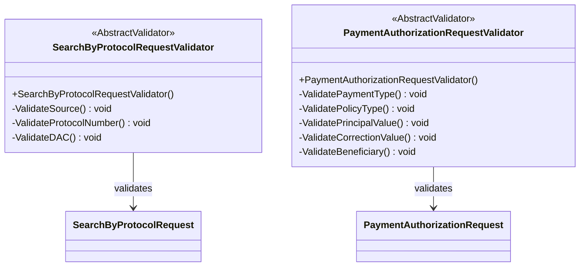
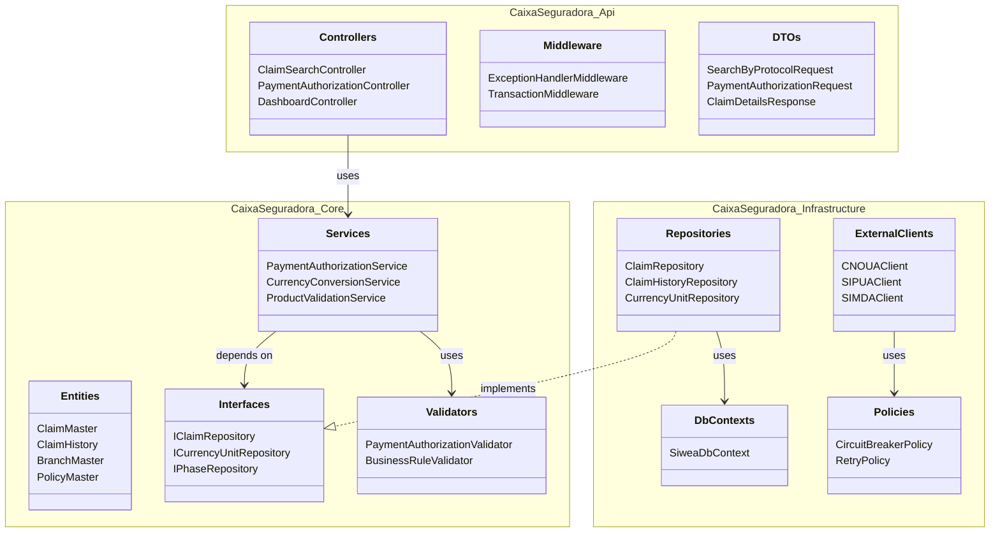
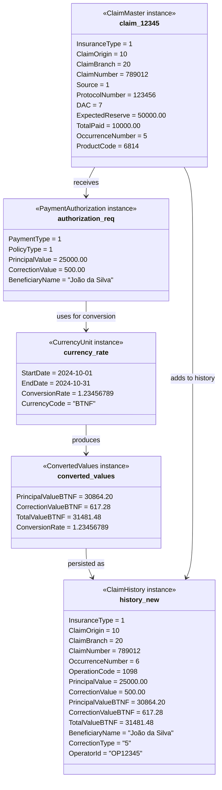

# Diagramas de Classes - SIWEA

## Diagrama de Classes Principal - Domain Model

---

## Diagrama de Classes - Camada de Domínio (Core)

```mermaid
classDiagram
    %% DOMAIN SERVICES
    class PaymentAuthorizationService {
        <<Domain Service>>
        -IClaimRepository claimRepository
        -ICurrencyConverter currencyConverter
        -IProductValidator productValidator
        -IPhaseManager phaseManager
        +AuthorizePayment(claimId, authorization) Result
        +ValidateAuthorization(authorization) bool
        -CalculateBTNFValues(authorization) ConvertedValues
        -ValidateProduct(productCode, claimData) ValidationResult
        -RecordTransaction(claim, authorization, convertedValues) void
    }

    class CurrencyConversionService {
        <<Domain Service>>
        -ICurrencyUnitRepository currencyRepository
        -ISystemControlRepository systemRepository
        +ConvertToBTNF(value, date) decimal
        +GetCurrentRate(date) CurrencyUnit
        +ValidateRateAvailability(date) bool
        -ApplyBankersRounding(value) decimal
    }

    class ProductValidationService {
        <<Domain Service>>
        -ICNOUAClient cnouaClient
        -ISIPUAClient sipuaClient
        -ISIMDAClient simdaClient
        -IConsortiumContractRepository contractRepository
        +ValidateProduct(productCode, claimData) ValidationResult
        -DetermineValidationRoute(productCode, contractNumber) string
        -CallCNOUA(claimData) ValidationResult
        -CallSIPUA(claimData) ValidationResult
        -CallSIMDA(claimData) ValidationResult
    }

    class PhaseManagementService {
        <<Domain Service>>
        -IPhaseRepository phaseRepository
        -IPhaseEventRepository eventRepository
        +UpdatePhases(claimId, eventCode) void
        +OpenPhase(claimId, phaseCode) void
        +ClosePhase(claimId, phaseCode) void
        -GetPhaseConfiguration(eventCode) List~PhaseEventRelationship~
    }

    class SearchService {
        <<Domain Service>>
        -IClaimRepository claimRepository
        -IBranchRepository branchRepository
        -IPolicyRepository policyRepository
        +SearchByProtocol(source, protocol, dac) ClaimMaster
        +SearchByClaimNumber(origin, branch, number) ClaimMaster
        +SearchByLeaderCode(leaderCode, leaderClaim) ClaimMaster
        -LoadComplementaryData(claim) void
    }

    %% REPOSITORIES (INTERFACES)
    class IClaimRepository {
        <<Interface>>
        +FindByProtocol(source, protocol, dac) ClaimMaster
        +FindByClaimNumber(origin, branch, number) ClaimMaster
        +FindByLeaderCode(leaderCode, leaderClaim) ClaimMaster
        +Update(claim) void
        +BeginTransaction() ITransaction
        +CommitTransaction() void
        +RollbackTransaction() void
    }

    class IClaimHistoryRepository {
        <<Interface>>
        +Insert(history) void
        +GetHistoryByClaim(claimId) List~ClaimHistory~
        +GetTotalPaidByClaim(claimId) decimal
    }

    class ICurrencyUnitRepository {
        <<Interface>>
        +GetRateForDate(date) CurrencyUnit
        +IsRateAvailable(date) bool
    }

    class IPhaseRepository {
        <<Interface>>
        +GetOpenPhases(claimId) List~ClaimPhase~
        +OpenPhase(phase) void
        +ClosePhase(claimId, phaseCode, closingDate) void
    }

    %% VALIDATORS
    class PaymentAuthorizationValidator {
        <<Validator>>
        +ValidatePaymentType(type) ValidationError[]
        +ValidatePolicyType(type) ValidationError[]
        +ValidatePrincipalValue(value, pendingBalance) ValidationError[]
        +ValidateBeneficiary(beneficiary, insuranceType) ValidationError[]
        +Validate(authorization, claim) ValidationResult
    }

    class BusinessRuleValidator {
        <<Validator>>
        +ValidateAmountAgainstPending(amount, pending) bool
        +ValidateInsuranceTypeForBeneficiary(type, beneficiary) bool
        +ValidatePaymentTypeRange(type) bool
        +ValidatePolicyTypeRange(type) bool
    }

    %% RELACIONAMENTOS
    PaymentAuthorizationService --> IClaimRepository : uses
    PaymentAuthorizationService --> CurrencyConversionService : uses
    PaymentAuthorizationService --> ProductValidationService : uses
    PaymentAuthorizationService --> PhaseManagementService : uses
    PaymentAuthorizationService --> PaymentAuthorizationValidator : validates with

    CurrencyConversionService --> ICurrencyUnitRepository : uses
    ProductValidationService --> IConsortiumContractRepository : uses
    PhaseManagementService --> IPhaseRepository : uses
    SearchService --> IClaimRepository : uses

    PaymentAuthorizationValidator --> BusinessRuleValidator : uses
```

---

## Diagrama de Classes - Camada de API

```mermaid
classDiagram
    %% CONTROLLERS
    class ClaimSearchController {
        <<Controller>>
        -SearchService searchService
        -IMapper mapper
        +SearchByProtocol(request) IActionResult
        +SearchByClaimNumber(request) IActionResult
        +SearchByLeaderCode(request) IActionResult
    }

    class PaymentAuthorizationController {
        <<Controller>>
        -PaymentAuthorizationService authService
        -IMapper mapper
        +AuthorizePayment(request) IActionResult
        +GetAuthorizationHistory(claimId) IActionResult
    }

    class DashboardController {
        <<Controller>>
        -IDashboardService dashboardService
        +GetMigrationStatus() IActionResult
        +GetComponentStatus() IActionResult
        +GetPerformanceMetrics() IActionResult
    }

    %% DTOs - REQUEST
    class SearchByProtocolRequest {
        <<DTO>>
        +int Source
        +int ProtocolNumber
        +int DAC
        +void Validate()
    }

    class PaymentAuthorizationRequest {
        <<DTO>>
        +int ClaimId
        +int PaymentType
        +int PolicyType
        +decimal PrincipalValue
        +decimal CorrectionValue
        +string BeneficiaryName
        +void Validate()
    }

    %% DTOs - RESPONSE
    class ClaimDetailsResponse {
        <<DTO>>
        +string Protocol
        +string ClaimNumber
        +string BranchName
        +string InsuredName
        +decimal ExpectedReserve
        +decimal TotalPaid
        +decimal PendingValue
        +int ProductCode
        +int InsuranceType
    }

    class PaymentAuthorizationResponse {
        <<DTO>>
        +string TransactionId
        +bool Success
        +string Message
        +decimal AuthorizedAmount
        +decimal NewPendingBalance
        +DateTime AuthorizationDate
    }

    class ValidationErrorResponse {
        <<DTO>>
        +string ErrorCode
        +string Message
        +string Field
        +string Details
    }

    %% MIDDLEWARE
    class ExceptionHandlerMiddleware {
        <<Middleware>>
        +InvokeAsync(context, next) Task
        -HandleException(context, exception) Task
        -LogError(exception) void
    }

    class TransactionMiddleware {
        <<Middleware>>
        +InvokeAsync(context, next) Task
        -BeginTransaction() void
        -CommitOrRollback(success) void
    }

    %% RELACIONAMENTOS
    ClaimSearchController --> SearchService : uses
    ClaimSearchController --> SearchByProtocolRequest : receives
    ClaimSearchController --> ClaimDetailsResponse : returns

    PaymentAuthorizationController --> PaymentAuthorizationService : uses
    PaymentAuthorizationController --> PaymentAuthorizationRequest : receives
    PaymentAuthorizationController --> PaymentAuthorizationResponse : returns

    ExceptionHandlerMiddleware --> ValidationErrorResponse : creates
    TransactionMiddleware --> IClaimRepository : manages transaction
```

---

## Diagrama de Classes - Camada de Infraestrutura

```mermaid
classDiagram
    %% REPOSITORIES (IMPLEMENTATION)
    class ClaimRepository {
        <<Repository>>
        -SiweaDbContext context
        +FindByProtocol(source, protocol, dac) ClaimMaster
        +FindByClaimNumber(origin, branch, number) ClaimMaster
        +FindByLeaderCode(leaderCode, leaderClaim) ClaimMaster
        +Update(claim) void
        +BeginTransaction() ITransaction
        +CommitTransaction() void
        +RollbackTransaction() void
    }

    class ClaimHistoryRepository {
        <<Repository>>
        -SiweaDbContext context
        +Insert(history) void
        +GetHistoryByClaim(claimId) List~ClaimHistory~
        +GetTotalPaidByClaim(claimId) decimal
    }

    class CurrencyUnitRepository {
        <<Repository>>
        -SiweaDbContext context
        +GetRateForDate(date) CurrencyUnit
        +IsRateAvailable(date) bool
    }

    %% DB CONTEXT
    class SiweaDbContext {
        <<DbContext>>
        +DbSet~ClaimMaster~ ClaimMasters
        +DbSet~ClaimHistory~ ClaimHistories
        +DbSet~BranchMaster~ BranchMasters
        +DbSet~PolicyMaster~ PolicyMasters
        +DbSet~CurrencyUnit~ CurrencyUnits
        +DbSet~SystemControl~ SystemControls
        +DbSet~ClaimAccompaniment~ ClaimAccompaniments
        +DbSet~ClaimPhase~ ClaimPhases
        +DbSet~PhaseEventRelationship~ PhaseEventRelationships
        +DbSet~ConsortiumContract~ ConsortiumContracts
        #OnModelCreating(modelBuilder) void
    }

    %% ENTITY CONFIGURATIONS
    class ClaimMasterConfiguration {
        <<IEntityTypeConfiguration>>
        +Configure(builder) void
    }

    class ClaimHistoryConfiguration {
        <<IEntityTypeConfiguration>>
        +Configure(builder) void
    }

    %% EXTERNAL SERVICE CLIENTS
    class CNOUAClient {
        <<External Client>>
        -HttpClient httpClient
        -ICircuitBreakerPolicy circuitBreaker
        -IRetryPolicy retryPolicy
        +ValidateConsortiumProduct(request) ValidationResult
        -PrepareRequest(claimData) HttpRequestMessage
        -ParseResponse(response) ValidationResult
    }

    class SIPUAClient {
        <<External Client>>
        -ISoapClient soapClient
        -ICircuitBreakerPolicy circuitBreaker
        -IRetryPolicy retryPolicy
        +ValidateEFPContract(request) ValidationResult
        -BuildSoapEnvelope(claimData) string
        -ParseSoapResponse(xml) ValidationResult
    }

    class SIMDAClient {
        <<External Client>>
        -ISoapClient soapClient
        -ICircuitBreakerPolicy circuitBreaker
        -IRetryPolicy retryPolicy
        +ValidateHBContract(request) ValidationResult
        -BuildSoapEnvelope(claimData) string
        -ParseSoapResponse(xml) ValidationResult
    }

    %% RESILIENCE POLICIES
    class CircuitBreakerPolicy {
        <<Policy>>
        -int failureThreshold
        -TimeSpan openDuration
        -CircuitState state
        +ExecuteAsync(action) Task
        +OnFailure() void
        +OnSuccess() void
        +TryReset() bool
    }

    class RetryPolicy {
        <<Policy>>
        -int maxRetries
        -TimeSpan[] backoffIntervals
        +ExecuteAsync(action) Task
        -CalculateBackoff(attemptNumber) TimeSpan
    }

    %% RELACIONAMENTOS
    ClaimRepository --> SiweaDbContext : uses
    ClaimHistoryRepository --> SiweaDbContext : uses
    CurrencyUnitRepository --> SiweaDbContext : uses

    SiweaDbContext --> ClaimMasterConfiguration : uses
    SiweaDbContext --> ClaimHistoryConfiguration : uses

    ClaimRepository ..|> IClaimRepository : implements
    ClaimHistoryRepository ..|> IClaimHistoryRepository : implements
    CurrencyUnitRepository ..|> ICurrencyUnitRepository : implements

    CNOUAClient --> CircuitBreakerPolicy : uses
    CNOUAClient --> RetryPolicy : uses
    SIPUAClient --> CircuitBreakerPolicy : uses
    SIPUAClient --> RetryPolicy : uses
    SIMDAClient --> CircuitBreakerPolicy : uses
    SIMDAClient --> RetryPolicy : uses

    CNOUAClient ..|> ICNOUAClient : implements
    SIPUAClient ..|> ISIPUAClient : implements
    SIMDAClient ..|> ISIMDAClient : implements
```

---

## Diagrama de Classes - AutoMapper Profiles

---

## Diagrama de Classes - Validators (FluentValidation)

---

## Diagrama de Pacotes - Arquitetura Clean

**Dependências:**
- **Api → Core**: Controllers chamam Services
- **Core → Core**: Services usam Entities e Interfaces
- **Infrastructure → Core**: Repositories implementam Interfaces
- **Infrastructure → Infrastructure**: DbContext gerencia Entities

---

## Diagrama de Objetos - Exemplo de Autorização

**Fluxo:**
1. `claim_12345` (sinistro existente) recebe `authorization_req`
2. `currency_rate` (taxa do dia) converte valores
3. `converted_values` são calculados
4. `history_new` é criado e persistido
5. `claim_12345.TotalPaid` atualizado para 41481.48
6. `claim_12345.OccurrenceNumber` incrementado para 6

---

## Resumo de Classes por Camada

### API Layer (10 classes)
- **Controllers:** 3 (ClaimSearch, PaymentAuthorization, Dashboard)
- **DTOs Request:** 3 (SearchByProtocol, PaymentAuthorization, etc.)
- **DTOs Response:** 3 (ClaimDetails, PaymentAuthorization, ValidationError)
- **Middleware:** 2 (ExceptionHandler, Transaction)

### Core Layer (25+ classes)
- **Entities:** 13 (ClaimMaster, ClaimHistory, BranchMaster, etc.)
- **Value Objects:** 3 (PaymentAuthorization, ConvertedValues, ValidationResult)
- **Domain Services:** 5 (PaymentAuthorization, CurrencyConversion, ProductValidation, PhaseManagement, Search)
- **Repositories (Interfaces):** 6 (IClaim, IClaimHistory, ICurrencyUnit, IPhase, etc.)
- **Validators:** 2 (PaymentAuthorizationValidator, BusinessRuleValidator)

### Infrastructure Layer (15+ classes)
- **Repositories (Implementations):** 6 (ClaimRepository, ClaimHistoryRepository, etc.)
- **DbContext:** 1 (SiweaDbContext)
- **Entity Configurations:** 10+ (ClaimMasterConfiguration, etc.)
- **External Clients:** 3 (CNOUAClient, SIPUAClient, SIMDAClient)
- **Resilience Policies:** 2 (CircuitBreakerPolicy, RetryPolicy)

**Total:** ~50+ classes no sistema completo

---

## Padrões de Design Utilizados

| Padrão | Onde | Propósito |
|--------|------|-----------|
| **Repository** | Infrastructure | Abstração de acesso a dados |
| **Service Layer** | Core | Lógica de negócio centralizada |
| **DTO** | API | Transferência de dados entre camadas |
| **Dependency Injection** | Todas as camadas | Inversão de controle |
| **Unit of Work** | Infrastructure | Coordenar transações |
| **Circuit Breaker** | Infrastructure | Resiliência de integrações |
| **Retry** | Infrastructure | Tolerância a falhas temporárias |
| **Value Object** | Core | Objetos imutáveis sem identidade |
| **Entity** | Core | Objetos com identidade |
| **Factory** | Core | Criação de objetos complexos |
| **Validator** | Core/API | Validação de regras de negócio |
| **Mapper** | API | Conversão entre objetos |

---

**FIM DO DOCUMENTO - DIAGRAMAS DE CLASSES**
