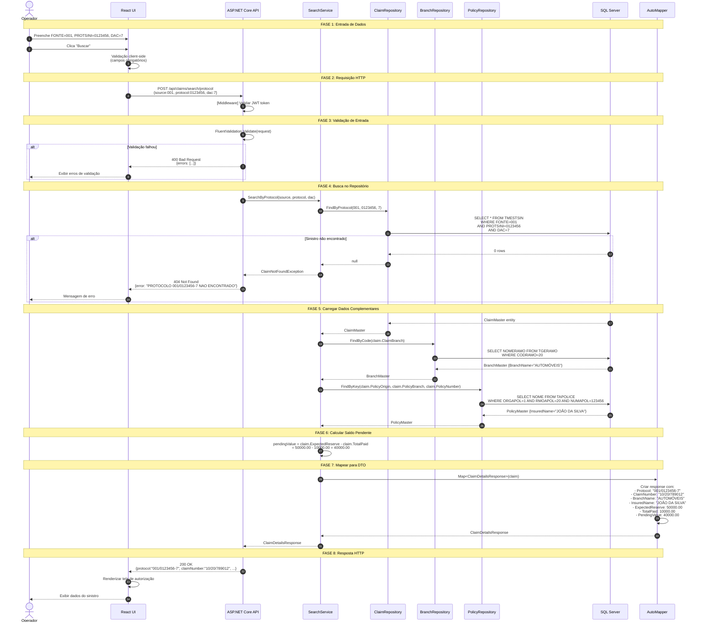
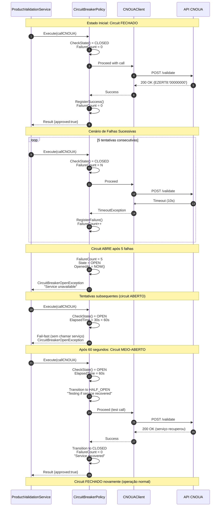
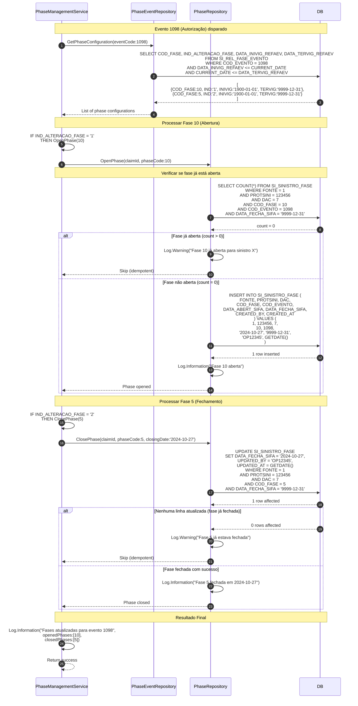
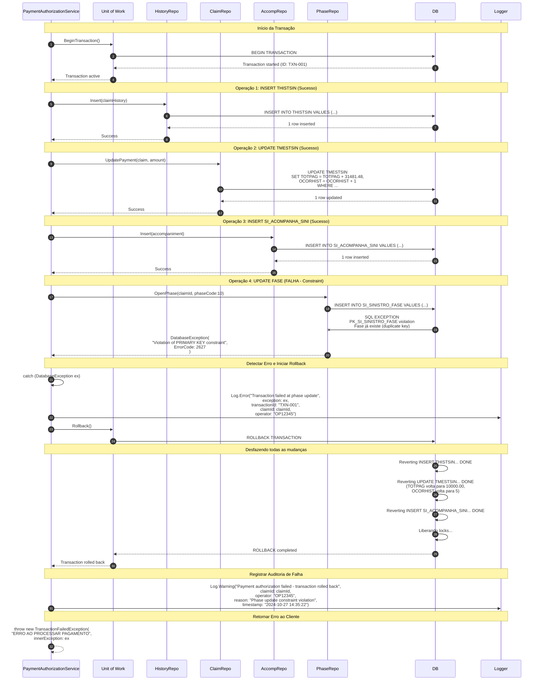

# Diagramas de Sequência - SIWEA

## Sequência 1: Busca de Sinistro por Protocolo (Fluxo Completo)



**Tempo Total Esperado:** 1-2 segundos
- Validação: <100ms
- Query principal: 200-500ms
- Queries complementares: 100-300ms cada
- Mapeamento: <50ms

---

## Sequência 2: Autorização de Pagamento (Fluxo Completo com Validação Externa)

```mermaid
sequenceDiagram
    autonumber
    actor Operador
    participant Browser
    participant API
    participant AuthSvc as PaymentAuthorizationService
    participant Validator as PaymentAuthorizationValidator
    participant CurrencySvc as CurrencyConversionService
    participant ProductSvc as ProductValidationService
    participant PhaseSvc as PhaseManagementService
    participant ClaimRepo
    participant HistoryRepo
    participant AccompRepo as AccompanimentRepository
    participant PhaseRepo
    participant CNOUAClient
    participant DB
    participant UOW as Unit of Work

    Note over Operador,UOW: FASE 1: Entrada de Dados
    Operador->>Browser: Preenche:<br/>- Tipo Pagamento: 1<br/>- Tipo Apólice: 1<br/>- Valor Principal: 25000.00<br/>- Valor Correção: 500.00<br/>- Beneficiário: "João da Silva"
    Operador->>Browser: Clica "Autorizar"

    Note over Operador,UOW: FASE 2: Requisição HTTP
    Browser->>API: POST /api/payments/authorize<br/>{claimId, paymentType:1, policyType:1, principal:25000, correction:500, beneficiary:"João"}
    API->>API: [Middleware] ValidateJWT()
    API->>API: [Middleware] ValidateRequestModel()

    Note over Operador,UOW: FASE 3: Validações de Entrada
    API->>AuthSvc: AuthorizePayment(claimId, authorizationRequest)
    AuthSvc->>Validator: Validate(authorizationRequest)
    Validator->>Validator: ✓ PaymentType IN (1,2,3,4,5)
    Validator->>Validator: ✓ PolicyType IN (1,2)
    Validator->>Validator: ✓ PrincipalValue > 0

    alt Validação falhou
        Validator-->>AuthSvc: ValidationResult {IsValid:false, Errors:[...]}
        AuthSvc-->>API: ValidationException
        API-->>Browser: 400 Bad Request {errors}
        Browser-->>Operador: Exibir erros
    end

    Validator-->>AuthSvc: ValidationResult {IsValid:true}

    Note over Operador,UOW: FASE 4: Carregar Sinistro e Validar Saldo
    AuthSvc->>ClaimRepo: FindById(claimId)
    ClaimRepo->>DB: SELECT * FROM TMESTSIN WHERE...
    DB-->>ClaimRepo: ClaimMaster {SDOPAG:50000, TOTPAG:10000, CODPRODU:6814}
    ClaimRepo-->>AuthSvc: ClaimMaster

    AuthSvc->>AuthSvc: pendingValue = 50000 - 10000 = 40000
    AuthSvc->>AuthSvc: IF 25000 > 40000 THEN error

    alt Valor excede saldo
        AuthSvc-->>API: BusinessRuleException("VALOR EXCEDE SALDO PENDENTE")
        API-->>Browser: 422 Unprocessable Entity
        Browser-->>Operador: Mensagem de erro
    end

    Note over Operador,UOW: FASE 5: Validar Beneficiário
    AuthSvc->>AuthSvc: IF claim.InsuranceType != 0<br/>AND beneficiary IS NULL<br/>THEN error

    alt Beneficiário obrigatório não informado
        AuthSvc-->>API: ValidationException("BENEFICIARIO OBRIGATORIO")
        API-->>Browser: 400 Bad Request
        Browser-->>Operador: Erro
    end

    Note over Operador,UOW: FASE 6: Obter Taxa BTNF
    AuthSvc->>CurrencySvc: ConvertToBTNF(principal:25000, correction:500, date:TODAY)
    CurrencySvc->>DB: SELECT DTMOVABE FROM TSISTEMA WHERE IDSISTEM='SI'
    DB-->>CurrencySvc: businessDate = 2024-10-27
    CurrencySvc->>DB: SELECT VLCRUZAD FROM TGEUNIMO<br/>WHERE DTINIVIG <= '2024-10-27'<br/>AND '2024-10-27' <= DTTERVIG
    DB-->>CurrencySvc: ConversionRate = 1.23456789

    alt Taxa não encontrada
        DB-->>CurrencySvc: 0 rows
        CurrencySvc-->>AuthSvc: CurrencyRateNotFoundException
        AuthSvc-->>API: Exception("TAXA NAO DISPONIVEL")
        API-->>Browser: 500 Internal Server Error
        Browser-->>Operador: Erro de sistema
    end

    Note over Operador,UOW: FASE 7: Calcular Valores BTNF
    CurrencySvc->>CurrencySvc: principalBTNF = 25000.00 × 1.23456789<br/>= 30864.19725
    CurrencySvc->>CurrencySvc: Round(30864.19725, 2, MidpointRounding.ToEven)<br/>= 30864.20
    CurrencySvc->>CurrencySvc: correctionBTNF = 500.00 × 1.23456789<br/>= 617.283945
    CurrencySvc->>CurrencySvc: Round(617.283945, 2)<br/>= 617.28
    CurrencySvc->>CurrencySvc: totalBTNF = 30864.20 + 617.28<br/>= 31481.48
    CurrencySvc-->>AuthSvc: ConvertedValues {principal:30864.20, correction:617.28, total:31481.48}

    Note over Operador,UOW: FASE 8: Validação de Produto
    AuthSvc->>ProductSvc: ValidateProduct(productCode:6814, claimData)
    ProductSvc->>ProductSvc: DetermineRoute(6814)
    ProductSvc->>ProductSvc: IF 6814 IN (6814,7701,7709) THEN CNOUA

    Note over Operador,UOW: FASE 8.1: Chamada CNOUA (REST)
    ProductSvc->>CNOUAClient: ValidateConsortiumProduct(claimData)
    CNOUAClient->>CNOUAClient: [Circuit Breaker] CheckState()

    alt Circuit aberto (muitas falhas)
        CNOUAClient-->>ProductSvc: CircuitBreakerOpenException
        ProductSvc-->>AuthSvc: ServiceUnavailableException
        AuthSvc-->>API: Exception("SERVICO INDISPONIVEL")
        API-->>Browser: 503 Service Unavailable
        Browser-->>Operador: Erro de integração
    end

    CNOUAClient->>CNOUAClient: PrepareHttpRequest()<br/>{claimId, productCode, amount, contract}
    CNOUAClient->>CNOUAClient: POST https://api.caixa.gov.br/cnoua/v1/validate<br/>Timeout: 10s

    alt Timeout na primeira tentativa
        CNOUAClient->>CNOUAClient: Wait 10 seconds... TIMEOUT
        CNOUAClient->>CNOUAClient: [Retry Policy] Attempt 1 of 2<br/>Backoff: 1 second
        CNOUAClient->>CNOUAClient: POST (retry 1)

        alt Timeout na segunda tentativa
            CNOUAClient->>CNOUAClient: Wait 10 seconds... TIMEOUT
            CNOUAClient->>CNOUAClient: [Retry Policy] Attempt 2 of 2<br/>Backoff: 2 seconds
            CNOUAClient->>CNOUAClient: POST (retry 2)

            alt Timeout na terceira tentativa (final)
                CNOUAClient->>CNOUAClient: Wait 10 seconds... TIMEOUT
                CNOUAClient->>CNOUAClient: [Circuit Breaker] RegisterFailure()
                CNOUAClient-->>ProductSvc: TimeoutException
                ProductSvc-->>AuthSvc: ValidationTimeoutException
                AuthSvc-->>API: Exception("SERVICO VALIDACAO TIMEOUT")
                API-->>Browser: 504 Gateway Timeout
                Browser-->>Operador: Erro de timeout
            end
        end
    end

    Note over Operador,UOW: Resposta CNOUA recebida
    CNOUAClient->>CNOUAClient: Response received (200 OK)<br/>{EZERT8:"00000000", approved:true}
    CNOUAClient->>CNOUAClient: [Circuit Breaker] RegisterSuccess()
    CNOUAClient-->>ProductSvc: ValidationResult {EZERT8:"00000000", approved:true}

    alt EZERT8 != '00000000' (validação falhou)
        CNOUAClient-->>ProductSvc: ValidationResult {EZERT8:"EZERT8001", approved:false, message:"Contrato inválido"}
        ProductSvc-->>AuthSvc: ProductValidationException
        AuthSvc-->>API: Exception("VALIDACAO CONSORCIO FALHOU: Contrato inválido")
        API-->>Browser: 422 Unprocessable Entity
        Browser-->>Operador: Erro de validação
    end

    ProductSvc-->>AuthSvc: ValidationResult {approved:true}

    Note over Operador,UOW: FASE 9: Transação de Banco de Dados
    AuthSvc->>UOW: BeginTransaction()
    UOW->>DB: BEGIN TRANSACTION

    Note over Operador,UOW: FASE 9.1: INSERT THISTSIN
    AuthSvc->>HistoryRepo: Insert(claimHistory)
    HistoryRepo->>HistoryRepo: ClaimHistory {<br/>  OCORHIST = claim.OccurrenceNumber + 1,<br/>  OPERACAO = 1098,<br/>  TIPCRR = '5',<br/>  VALPRI = 25000.00,<br/>  CRRMON = 500.00,<br/>  VALPRIBT = 30864.20,<br/>  CRRMONBT = 617.28,<br/>  VALTOTBT = 31481.48,<br/>  NOMFAV = "João da Silva",<br/>  EZEUSRID = "OP12345"<br/>}
    HistoryRepo->>DB: INSERT INTO THISTSIN VALUES (...)
    DB-->>HistoryRepo: 1 row inserted

    alt INSERT falhou (constraint violation)
        DB-->>HistoryRepo: SQL Exception (PK violation)
        HistoryRepo-->>AuthSvc: DatabaseException
        AuthSvc->>UOW: Rollback()
        UOW->>DB: ROLLBACK TRANSACTION
        AuthSvc-->>API: Exception("ERRO AO REGISTRAR PAGAMENTO")
        API-->>Browser: 500 Internal Server Error
        Browser-->>Operador: Erro de sistema
    end

    HistoryRepo-->>AuthSvc: Success

    Note over Operador,UOW: FASE 9.2: UPDATE TMESTSIN
    AuthSvc->>ClaimRepo: UpdatePayment(claim, totalBTNF:31481.48)
    ClaimRepo->>ClaimRepo: claim.TotalPaid += 31481.48<br/>= 10000.00 + 31481.48<br/>= 41481.48
    ClaimRepo->>ClaimRepo: claim.OccurrenceNumber++<br/>= 5 + 1 = 6
    ClaimRepo->>DB: UPDATE TMESTSIN<br/>SET TOTPAG = 41481.48,<br/>    OCORHIST = 6<br/>WHERE TIPSEG=1 AND ORGSIN=10<br/>  AND RMOSIN=20 AND NUMSIN=789012
    DB-->>ClaimRepo: 1 row affected

    alt UPDATE falhou (0 rows affected - concurrency)
        DB-->>ClaimRepo: 0 rows affected
        ClaimRepo-->>AuthSvc: ConcurrencyException
        AuthSvc->>UOW: Rollback()
        UOW->>DB: ROLLBACK
        AuthSvc-->>API: Exception("SINISTRO FOI MODIFICADO POR OUTRO USUARIO")
        API-->>Browser: 409 Conflict
        Browser-->>Operador: Erro de concorrência
    end

    ClaimRepo-->>AuthSvc: Success

    Note over Operador,UOW: FASE 9.3: INSERT SI_ACOMPANHA_SINI
    AuthSvc->>AccompRepo: Insert(accompaniment)
    AccompRepo->>DB: INSERT INTO SI_ACOMPANHA_SINI<br/>(FONTE, PROTSINI, DAC, COD_EVENTO, DATA_MOVTO, NUM_OCORR)<br/>VALUES (1, 123456, 7, 1098, '2024-10-27', 6)
    DB-->>AccompRepo: 1 row inserted
    AccompRepo-->>AuthSvc: Success

    Note over Operador,UOW: FASE 9.4: Atualizar Fases
    AuthSvc->>PhaseSvc: UpdatePhases(claimId, eventCode:1098)
    PhaseSvc->>DB: SELECT COD_FASE, IND_ALTERACAO_FASE<br/>FROM SI_REL_FASE_EVENTO<br/>WHERE COD_EVENTO=1098
    DB-->>PhaseSvc: [<br/>  {COD_FASE:10, IND:'1'},<br/>  {COD_FASE:5, IND:'2'}<br/>]

    loop Para cada fase
        alt IND_ALTERACAO_FASE = '1' (Abrir fase 10)
            PhaseSvc->>PhaseRepo: OpenPhase(claimId, phaseCode:10)
            PhaseRepo->>DB: SELECT COUNT(*) FROM SI_SINISTRO_FASE<br/>WHERE FONTE=1 AND PROTSINI=123456 AND DAC=7<br/>  AND COD_FASE=10 AND DATA_FECHA='9999-12-31'
            DB-->>PhaseRepo: count = 0 (fase não aberta)
            PhaseRepo->>DB: INSERT INTO SI_SINISTRO_FASE<br/>(FONTE, PROTSINI, DAC, COD_FASE, COD_EVENTO, DATA_ABERT, DATA_FECHA)<br/>VALUES (1, 123456, 7, 10, 1098, '2024-10-27', '9999-12-31')
            DB-->>PhaseRepo: 1 row inserted
        end

        alt IND_ALTERACAO_FASE = '2' (Fechar fase 5)
            PhaseSvc->>PhaseRepo: ClosePhase(claimId, phaseCode:5, date:'2024-10-27')
            PhaseRepo->>DB: UPDATE SI_SINISTRO_FASE<br/>SET DATA_FECHA = '2024-10-27'<br/>WHERE FONTE=1 AND PROTSINI=123456 AND DAC=7<br/>  AND COD_FASE=5 AND DATA_FECHA='9999-12-31'
            DB-->>PhaseRepo: 1 row updated
        end
    end

    PhaseRepo-->>PhaseSvc: Success
    PhaseSvc-->>AuthSvc: Phases updated

    Note over Operador,UOW: FASE 10: COMMIT Transação
    AuthSvc->>UOW: Commit()
    UOW->>DB: COMMIT TRANSACTION
    DB-->>UOW: Transaction committed
    UOW-->>AuthSvc: Success

    Note over Operador,UOW: FASE 11: LOG de Auditoria
    AuthSvc->>AuthSvc: Log.Information("Pagamento autorizado",<br/>  claimId, amount, operator, timestamp)

    Note over Operador,UOW: FASE 12: Retornar Resposta
    AuthSvc-->>API: PaymentAuthorizationResult {<br/>  success:true,<br/>  transactionId:"TXN-20241027-001",<br/>  authorizedAmount:31481.48,<br/>  newPendingBalance:8518.52<br/>}
    API-->>Browser: 200 OK {success:true, ...}
    Browser->>Browser: Exibir mensagem de sucesso
    Browser-->>Operador: "PAGAMENTO AUTORIZADO COM SUCESSO"<br/>Novo saldo pendente: R$ 8.518,52
```



**Tempo Total Esperado:** 5-15 segundos
- Validações: <200ms
- Conversão BTNF: 200-500ms
- Validação CNOUA: 1-10s (com retries)
- Transação DB: 500-1000ms
- Total: Dentro do SLA de 90 segundos

**Pontos de Falha e Recuperação:**
1. **Validação de entrada:** Retorna 400 Bad Request imediatamente
2. **Taxa BTNF não disponível:** Retorna 500, operador contacta suporte
3. **Timeout CNOUA:** Retries automáticos, circuit breaker após 5 falhas
4. **Erro de transação:** Rollback automático, dados não corrompidos
5. **Concorrência:** Retorna 409, operador recarrega sinistro e tenta novamente

---

## Sequência 3: Validação de Produto com Circuit Breaker



**Estados do Circuit Breaker:**
- **CLOSED:** Operação normal, todas as chamadas passam
- **OPEN:** Circuit aberto após 5 falhas, fail-fast por 60 segundos
- **HALF_OPEN:** Testando recuperação com 1 chamada

**Configuração:**
```csharp
CircuitBreakerPolicy:
  FailureThreshold: 5 consecutive failures
  OpenDuration: 60 seconds
  HalfOpenTestCalls: 1
  ResetAfterSuccess: 2 consecutive successes
```

---

## Sequência 4: Gestão de Fases (Abertura e Fechamento)



**Resultado Visual:**

Antes do evento 1098:
```
SI_SINISTRO_FASE:
FONTE | PROTSINI | DAC | COD_FASE | COD_EVENTO | DATA_ABERT_SIFA | DATA_FECHA_SIFA
------|----------|-----|----------|------------|-----------------|----------------
1     | 123456   | 7   | 5        | 1097       | 2024-10-20      | 9999-12-31 ✓
```

Após evento 1098:
```
SI_SINISTRO_FASE:
FONTE | PROTSINI | DAC | COD_FASE | COD_EVENTO | DATA_ABERT_SIFA | DATA_FECHA_SIFA
------|----------|-----|----------|------------|-----------------|----------------
1     | 123456   | 7   | 5        | 1097       | 2024-10-20      | 2024-10-27 ✓ (FECHADA)
1     | 123456   | 7   | 10       | 1098       | 2024-10-27      | 9999-12-31 ✓ (ABERTA)
```

---

## Sequência 5: Rollback de Transação (Cenário de Erro)



**Estado do Banco de Dados:**

**ANTES da transação:**
```
TMESTSIN:
TOTPAG = 10000.00
OCORHIST = 5

THISTSIN:
(5 registros anteriores)

SI_ACOMPANHA_SINI:
(registros anteriores)

SI_SINISTRO_FASE:
(fases anteriores)
```

**DURANTE a transação (antes do erro):**
```
TMESTSIN:
TOTPAG = 41481.48 ← modificado
OCORHIST = 6 ← modificado

THISTSIN:
(6 registros - 1 novo) ← inserido

SI_ACOMPANHA_SINI:
(N registros - 1 novo) ← inserido

SI_SINISTRO_FASE:
(tentando inserir fase 10...) ← ERRO aqui
```

**DEPOIS do ROLLBACK:**
```
TMESTSIN:
TOTPAG = 10000.00 ← restaurado
OCORHIST = 5 ← restaurado

THISTSIN:
(5 registros) ← INSERT desfeito

SI_ACOMPANHA_SINI:
(registros originais) ← INSERT desfeito

SI_SINISTRO_FASE:
(fases originais) ← nenhuma mudança
```

**Garantia ACID:**
- ✅ **Atomicidade:** Todas as 4 operações desfeitas (all-or-nothing)
- ✅ **Consistência:** Nenhuma inconsistência de dados
- ✅ **Isolamento:** Outras transações não veem mudanças não-comitadas
- ✅ **Durabilidade:** Não aplicável (rollback intencional)

---

## Resumo de Tempos por Sequência

| Sequência | Operação | Tempo Esperado | SLA |
|-----------|----------|----------------|-----|
| **SEQ-1** | Busca de Sinistro | 1-2s | < 3s |
| **SEQ-2** | Autorização Completa | 5-15s | < 90s |
| **SEQ-3** | Circuit Breaker Recovery | 60s | N/A |
| **SEQ-4** | Gestão de Fases | 200-500ms | < 2s |
| **SEQ-5** | Rollback | 100-300ms | < 1s |

---

## Pontos de Observabilidade (Logging)

Cada sequência deve registrar:
1. **Início:** Timestamp, usuário, parâmetros
2. **Checkpoints:** Cada fase importante (validação, conversão, etc.)
3. **Integrações:** Request/response de serviços externos
4. **Transações:** BEGIN, COMMIT, ROLLBACK
5. **Erros:** Stack trace completo, contexto
6. **Fim:** Duração total, resultado

**Exemplo de Log:**
```json
{
  "timestamp": "2024-10-27T14:35:22.123Z",
  "level": "INFO",
  "message": "Payment authorization completed",
  "claimId": "1-10-20-789012",
  "operator": "OP12345",
  "amount": 31481.48,
  "duration_ms": 8543,
  "external_calls": {
    "cnoua": {
      "status": "success",
      "duration_ms": 2341,
      "retries": 0
    }
  },
  "transaction": {
    "operations": 4,
    "status": "committed"
  }
}
```

---

**FIM DO DOCUMENTO - DIAGRAMAS DE SEQUÊNCIA**
