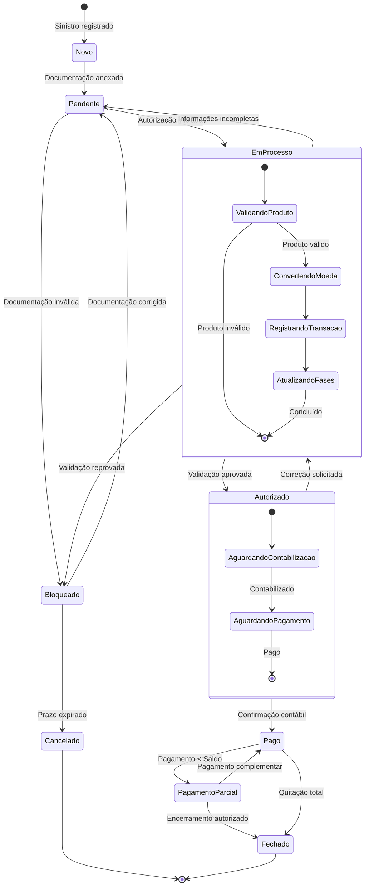
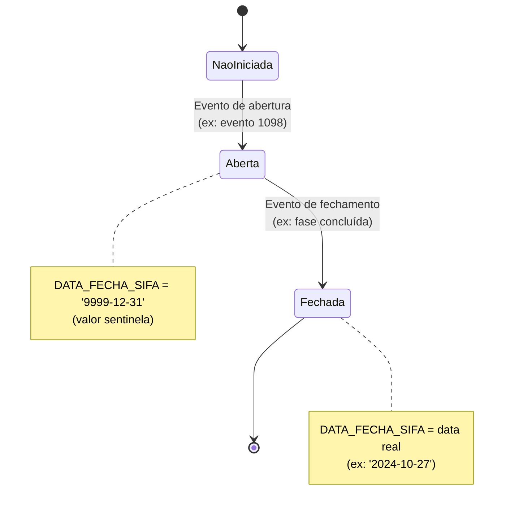
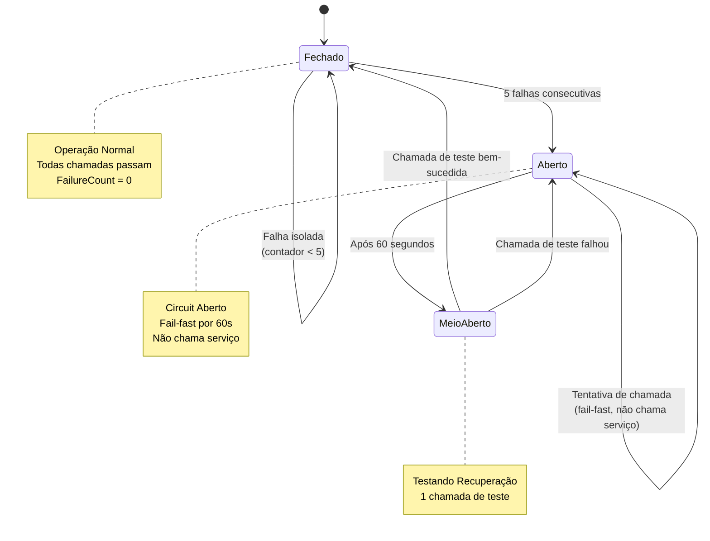
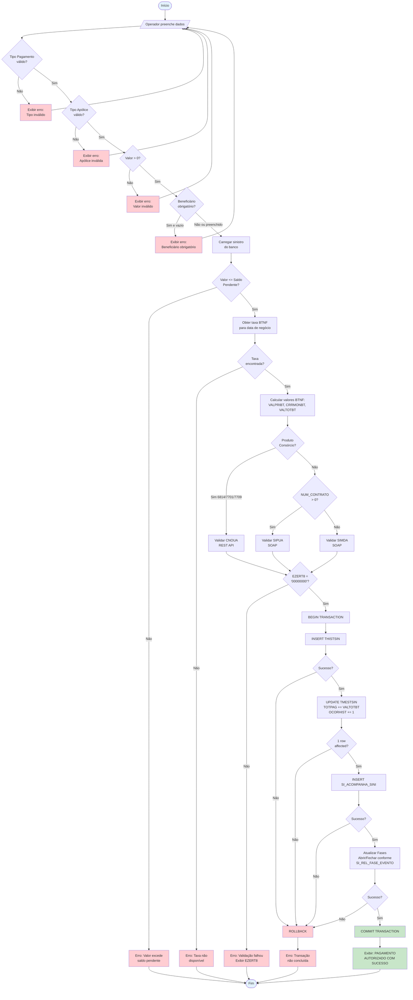
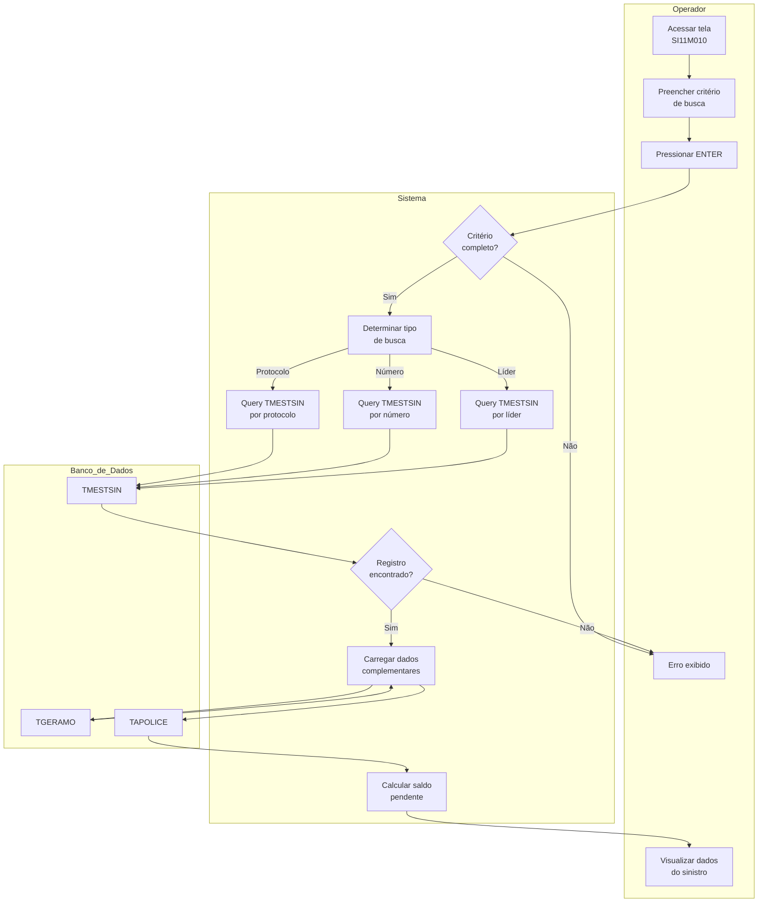
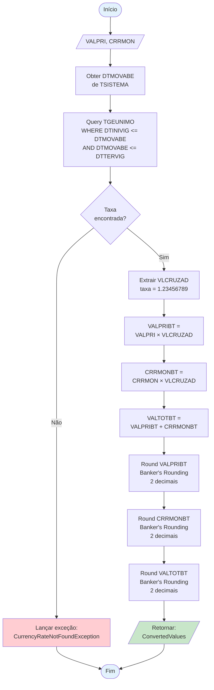
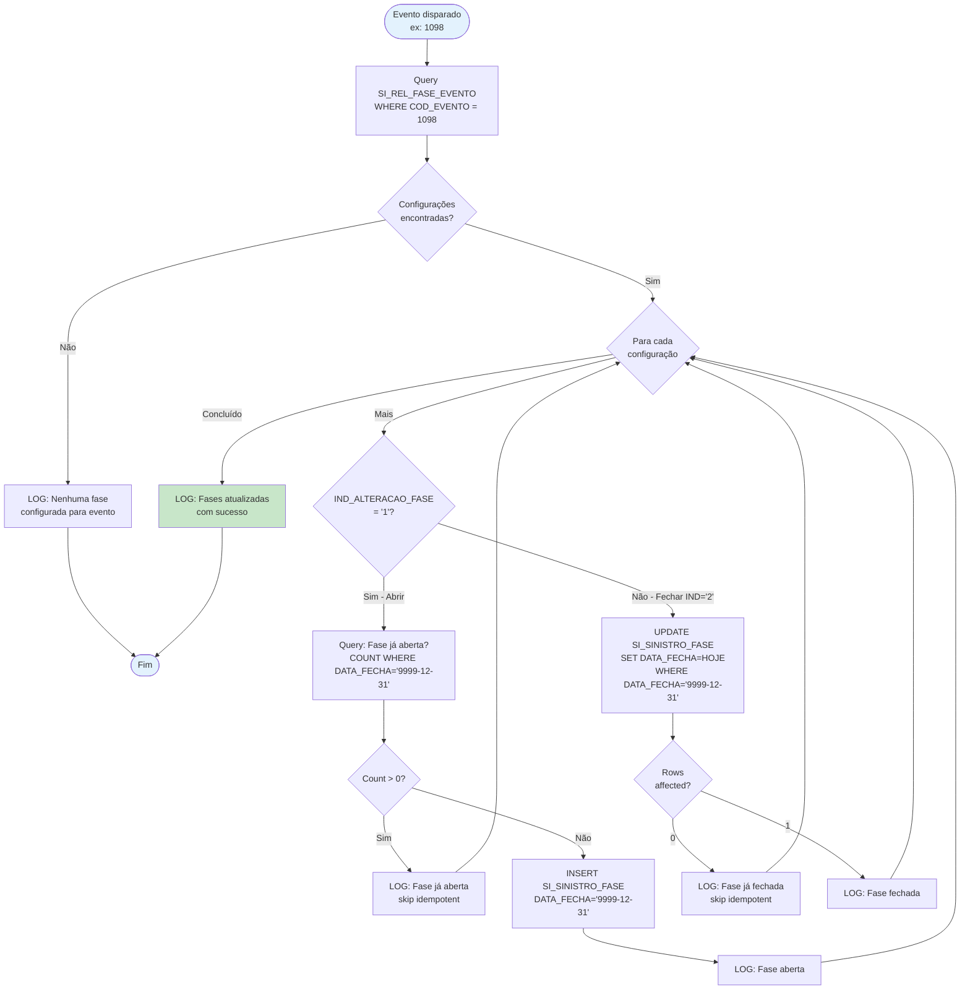
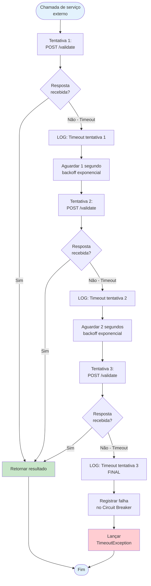
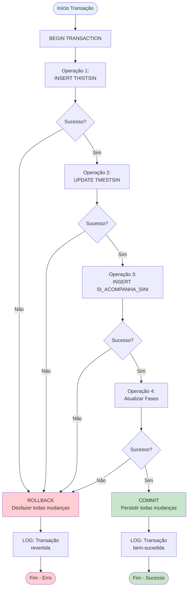
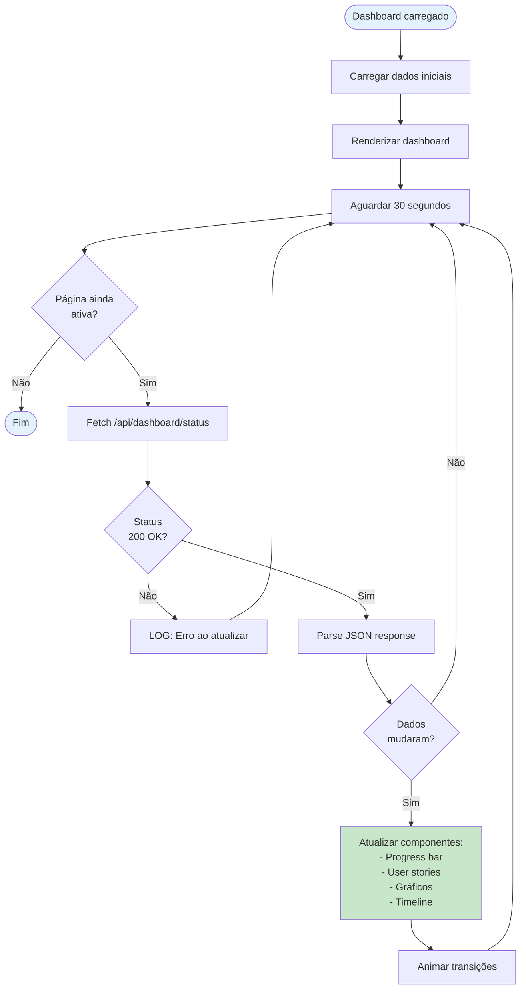

# Diagramas de Estado e Atividade - SIWEA

## Diagrama de Estados: Ciclo de Vida do Sinistro



**Descrição dos Estados:**

| Estado | Descrição | Condição de Entrada | Ações Possíveis |
|--------|-----------|---------------------|-----------------|
| **Novo** | Sinistro recém-criado | Registro inicial | Anexar documentação |
| **Pendente** | Aguardando análise | Documentação completa | Iniciar autorização |
| **EmProcesso** | Autorização em andamento | Validações iniciadas | Aguardar conclusão |
| **Bloqueado** | Pendência impeditiva | Validação falhou | Corrigir ou cancelar |
| **Autorizado** | Pagamento aprovado | Todas validações OK | Aguardar confirmação |
| **Pago** | Valor creditado | Confirmação contábil | Verificar saldo |
| **PagamentoParcial** | Saldo remanescente | Pagamento < Esperado | Novo pagamento |
| **Fechado** | Sinistro encerrado | Quitação total | Arquivar |
| **Cancelado** | Sinistro cancelado | Prazo/erro fatal | Arquivar |

---

## Diagrama de Estados: Fase do Sinistro



**Transições:**

| De | Para | Evento | Ação |
|----|------|--------|------|
| Não Iniciada | Aberta | Evento configurado em SI_REL_FASE_EVENTO com IND='1' | INSERT SI_SINISTRO_FASE com DATA_FECHA='9999-12-31' |
| Aberta | Fechada | Evento configurado em SI_REL_FASE_EVENTO com IND='2' | UPDATE SI_SINISTRO_FASE SET DATA_FECHA=HOJE |

**Exemplo:**
```
Fase 5 (Documentação Pendente):
  - Aberta em: 2024-10-20 (evento 1097)
  - DATA_FECHA: '9999-12-31' ← fase aberta
  - Fechada em: 2024-10-27 (evento 1098 - autorização)
  - DATA_FECHA: '2024-10-27' ← fase fechada

Fase 10 (Pagamento):
  - Aberta em: 2024-10-27 (evento 1098 - autorização)
  - DATA_FECHA: '9999-12-31' ← fase aberta
  - Permanece aberta até próximo evento
```

---

## Diagrama de Estados: Circuit Breaker



**Configuração:**
```csharp
CircuitBreakerPolicy:
  FailureThreshold: 5
  OpenDuration: 60 seconds
  HalfOpenTestCalls: 1
```

---

## Diagrama de Atividade: Autorização de Pagamento



---

## Diagrama de Atividade: Busca de Sinistro (Swimlanes)



---

## Diagrama de Atividade: Conversão Monetária BTNF



**Exemplo de Cálculo:**
```
Entrada:
  VALPRI = 25000.00
  CRRMON = 500.00
  VLCRUZAD = 1.23456789

Cálculo:
  VALPRIBT = 25000.00 × 1.23456789 = 30864.19725
  Round(30864.19725, 2, MidpointRounding.ToEven) = 30864.20

  CRRMONBT = 500.00 × 1.23456789 = 617.283945
  Round(617.283945, 2, MidpointRounding.ToEven) = 617.28

  VALTOTBT = 30864.20 + 617.28 = 31481.48

Saída:
  ConvertedValues {
    PrincipalValueBTNF: 30864.20,
    CorrectionValueBTNF: 617.28,
    TotalValueBTNF: 31481.48
  }
```

---

## Diagrama de Atividade: Gestão de Fases com Loop



---

## Diagrama de Atividade: Retry Policy com Backoff



**Configuração:**
```csharp
RetryPolicy:
  MaxRetries: 2 (total 3 tentativas)
  BackoffIntervals: [1s, 2s]
  Timeout per attempt: 10s
  Total max time: 32s (10s + 1s + 10s + 2s + 10s)
```

---

## Diagrama de Atividade: Transação ACID (4 Operações)



**Garantias ACID:**

| Propriedade | Como é garantida |
|-------------|------------------|
| **Atomicidade** | Se qualquer operação falhar (C1, C2, C3, C4), ROLLBACK desfaz todas |
| **Consistência** | Constraints do banco validados antes do COMMIT |
| **Isolamento** | READ COMMITTED - outras transações não veem mudanças não-comitadas |
| **Durabilidade** | Após COMMIT, mudanças sobrevivem a falhas do sistema (WAL logging) |

---

## Diagrama de Atividade: Dashboard Refresh Loop



---

## Resumo de Diagramas Criados

### Diagramas de Estado (4)
1. ✅ **Ciclo de Vida do Sinistro** - 9 estados principais
2. ✅ **Fase do Sinistro** - 3 estados (Não Iniciada → Aberta → Fechada)
3. ✅ **Circuit Breaker** - 3 estados (Fechado ↔ Aberto ↔ Meio-Aberto)
4. Estados compostos (EmProcesso, Autorizado) no diagrama 1

### Diagramas de Atividade (7)
1. ✅ **Autorização de Pagamento** - Fluxo completo com validações
2. ✅ **Busca de Sinistro** - Com swimlanes (Operador, Sistema, BD)
3. ✅ **Conversão Monetária BTNF** - Cálculos e arredondamento
4. ✅ **Gestão de Fases** - Loop com abertura/fechamento
5. ✅ **Retry Policy** - Backoff exponencial
6. ✅ **Transação ACID** - 4 operações com rollback
7. ✅ **Dashboard Refresh** - Loop de atualização

---

## Convenções de Notação

### Formas
- **Retângulo arredondado:** Estado
- **Losango:** Decisão
- **Retângulo:** Atividade/Processo
- **Paralelogramo:** Entrada/Saída de dados
- **Elipse:** Início/Fim

### Cores (Mermaid)
- 🟦 **Azul (#e3f2fd):** Início/Fim
- 🟩 **Verde (#c8e6c9):** Sucesso/Commit
- 🟥 **Vermelho (#ffcdd2):** Erro/Rollback

### Setas
- **Linha sólida (→):** Fluxo normal
- **Linha tracejada (-.->):** Fluxo alternativo
- **Seta dupla (↔):** Transição bidirecional

---

**FIM DO DOCUMENTO - DIAGRAMAS DE ESTADO E ATIVIDADE**
