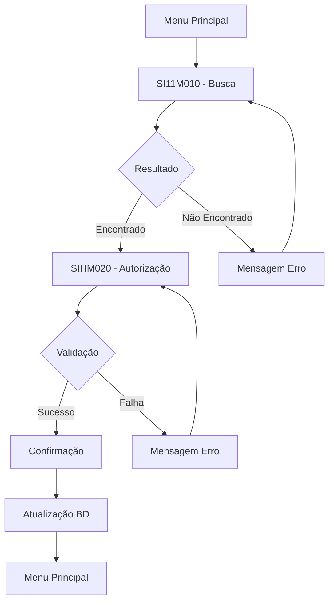
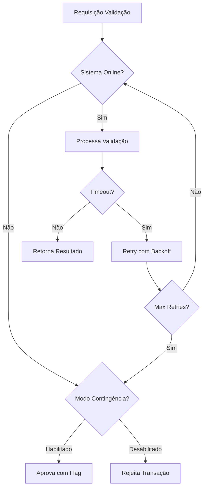

# 02 - Arquitetura Técnica: Sistema Legado SIWEA

[← Voltar ao Índice](README.md) | [→ Próximo: Estruturas de Dados](03-data-structures.md)

---

## Visão Geral da Arquitetura

### Diagrama de Arquitetura Completa

```
┌─────────────────────────────────────────────────────────────┐
│                     USUÁRIOS EXTERNOS                        │
│                  (200+ Operadores Autorizados)               │
└──────────────────────────┬──────────────────────────────────┘
                           │
                    TN3270 Protocol
                           │
┌──────────────────────────┴──────────────────────────────────┐
│                   CAMADA DE APRESENTAÇÃO                     │
│                  Terminal IBM 3270 / Emulador                │
│     ┌─────────────────────────────────────────────┐        │
│     │ SI11M010 - Tela de Busca de Sinistros      │        │
│     │ SIHM020 - Tela de Autorização de Pagamento │        │
│     └─────────────────────────────────────────────┘        │
└──────────────────────────┬──────────────────────────────────┘
                           │
                    CICS Transaction
                           │
┌──────────────────────────┴──────────────────────────────────┐
│                    CAMADA DE NEGÓCIO                        │
│                 IBM CICS Transaction Server                  │
│     ┌─────────────────────────────────────────────┐        │
│     │        SIWEA-V116 (Programa Principal)      │        │
│     │    IBM VisualAge EZEE 4.40 - COBOL/EZEE    │        │
│     ├─────────────────────────────────────────────┤        │
│     │ • Validação de Regras de Negócio (100+)    │        │
│     │ • Cálculo de Valores e Conversão BTNF      │        │
│     │ • Gestão de Fases e Workflow               │        │
│     │ • Integração com Sistemas Externos         │        │
│     │ • Controle Transacional e Rollback         │        │
│     └─────────────────────────────────────────────┘        │
└────────────┬─────────────────────────────┬──────────────────┘
             │                             │
        DB2 SQL/API                   Web Services
             │                             │
┌────────────┴─────────────┐   ┌──────────┴──────────────────┐
│    CAMADA DE DADOS       │   │   INTEGRAÇÕES EXTERNAS       │
│    IBM DB2 for z/OS      │   │                              │
│                          │   │  ┌────────────────────────┐  │
│  ┌──────────────────┐    │   │  │ CNOUA - Consórcio      │  │
│  │ 13 Entidades     │    │   │  ├────────────────────────┤  │
│  │ • TMESTSIN       │    │   │  │ SIPUA - Contratos EFP  │  │
│  │ • THISTSIN       │    │   │  ├────────────────────────┤  │
│  │ • TGERAMO        │    │   │  │ SIMDA - Contratos HB   │  │
│  │ • TGEUNIMO       │    │   │  └────────────────────────┘  │
│  │ • TSISTEMA       │    │   │                              │
│  │ • TAPOLICE       │    │   └──────────────────────────────┘
│  │ • SI_ACOMPANHA   │    │
│  │ • SI_SINISTRO    │    │
│  │ • SI_REL_FASE    │    │
│  │ • EF_CONTR_SEG   │    │
│  └──────────────────┘    │
└──────────────────────────┘
```

### Características Arquiteturais

| Aspecto | Descrição |
|---------|-----------|
| **Padrão Arquitetural** | 3-Tier (Três Camadas) |
| **Modelo de Processamento** | Online Transaction Processing (OLTP) |
| **Paradigma** | Procedural / Batch Processing |
| **Acoplamento** | Fortemente Acoplado (Monolítico) |
| **Estado** | Stateless entre transações |
| **Comunicação** | Síncrona (Request/Response) |
| **Deployment** | Mainframe Centralizado |

---

## Camada de Apresentação

### Terminal IBM 3270

#### Especificações Técnicas

| Característica | Valor |
|---------------|-------|
| **Protocolo** | TN3270 (Telnet 3270) |
| **Resolução** | 80 colunas × 24 linhas |
| **Codificação** | EBCDIC |
| **Cores Suportadas** | 7 cores (verde, amarelo, vermelho, azul, rosa, ciano, branco) |
| **Buffer de Tela** | 1920 caracteres (80×24) |
| **Atributos de Campo** | Normal, Intensified, Hidden, Protected |
| **Teclas de Função** | PF1-PF24, PA1-PA3, CLEAR, ENTER |

#### Mapa de Telas do Sistema

##### SI11M010 - Busca de Sinistros

```
Linha  1: ┌──────────────────────────────────────────────┐
Linha  2: │ SIWEA - SISTEMA DE LIBERAÇÃO DE PAGAMENTO     │
Linha  3: │ SI11M010 - BUSCA DE SINISTROS                 │
Linha  4: ├──────────────────────────────────────────────┤
Linha  5: │                                                │
Linha  6: │ CRITÉRIO 1 - POR PROTOCOLO:                   │
Linha  7: │   Fonte...: [___] (Protected)                 │
Linha  8: │   Protocolo: [________] (Input)               │
Linha  9: │   DAC.....: [_] (Input)                       │
Linha 10: │                                                │
Linha 11: │ CRITÉRIO 2 - POR SINISTRO:                    │
Linha 12: │   Origem..: [__] (Input)                      │
Linha 13: │   Ramo....: [__] (Input)                      │
Linha 14: │   Número..: [______] (Input)                  │
Linha 15: │                                                │
Linha 16: │ CRITÉRIO 3 - POR CÓDIGO LÍDER:                │
Linha 17: │   Líder...: [___] (Input)                     │
Linha 18: │   Sinistro: [_______] (Input)                 │
Linha 19: │                                                │
Linha 20: │ Mensagem: [_____________________________]     │
Linha 21: ├──────────────────────────────────────────────┤
Linha 22: │ PF3=Sair  PF12=Cancelar  ENTER=Buscar         │
Linha 23: └──────────────────────────────────────────────┘
```

##### SIHM020 - Autorização de Pagamento

```
Linha  1: ┌──────────────────────────────────────────────┐
Linha  2: │ SIWEA - SISTEMA DE LIBERAÇÃO DE PAGAMENTO     │
Linha  3: │ SIHM020 - AUTORIZAÇÃO DE PAGAMENTO            │
Linha  4: ├──────────────────────────────────────────────┤
Linha  5: │ DADOS DO SINISTRO:                            │
Linha  6: │   Protocolo.: 001/0123456-7 (Protected)       │
Linha  7: │   Sinistro..: 10/20/789012 (Protected)        │
Linha  8: │   Ramo......: AUTOMÓVEIS (Protected)          │
Linha  9: │   Segurado..: JOÃO DA SILVA (Protected)       │
Linha 10: │   Saldo.....: R$ 50.000,00 (Protected)        │
Linha 11: │                                                │
Linha 12: │ DADOS DA AUTORIZAÇÃO:                         │
Linha 13: │   Tipo Pagto: [_] (1-5) (Input)              │
Linha 14: │   Tipo Apól.: [_] (1-2) (Input)              │
Linha 15: │   Valor Prin: [___________] (Input)          │
Linha 16: │   Valor Corr: [___________] (Input)          │
Linha 17: │   Favorecido: [_____________________] (Input) │
Linha 18: │                                                │
Linha 19: │ Mensagem: [_____________________________]     │
Linha 20: ├──────────────────────────────────────────────┤
Linha 21: │ PF3=Voltar  PF12=Cancelar  ENTER=Autorizar    │
Linha 22: └──────────────────────────────────────────────┘
```

### Fluxo de Navegação



---

## Camada de Negócio

### IBM CICS Transaction Server

#### Configuração do Ambiente

| Parâmetro | Valor |
|-----------|-------|
| **CICS Version** | TS 5.x |
| **Region Type** | Application Owning Region (AOR) |
| **Max Tasks** | 500 |
| **Transaction Timeout** | 120 segundos |
| **Program Language** | COBOL/EZEE |
| **Compile Options** | RENT, REUS, APOST |

#### Programa Principal: SIWEA-V116

##### Estrutura Modular

```
SIWEA-V116 (Programa Principal)
│
├── MÓDULO DE INICIALIZAÇÃO
│   ├── Validação de Sessão CICS
│   ├── Inicialização de Variáveis
│   └── Obtenção de Data Sistema (TSISTEMA)
│
├── MÓDULO DE BUSCA
│   ├── Validação de Critérios
│   ├── Montagem de Query SQL
│   └── Execução e Retorno de Resultados
│
├── MÓDULO DE VALIDAÇÃO
│   ├── Regras de Negócio (100+)
│   ├── Validação de Limites
│   └── Verificação de Duplicidade
│
├── MÓDULO DE CÁLCULO
│   ├── Conversão Monetária (BTNF)
│   ├── Cálculo de Saldos
│   └── Atualização de Totais
│
├── MÓDULO DE INTEGRAÇÃO
│   ├── CNOUA (Consórcio)
│   ├── SIPUA (EFP)
│   └── SIMDA (HB)
│
├── MÓDULO DE PERSISTÊNCIA
│   ├── INSERT em THISTSIN
│   ├── UPDATE em TMESTSIN
│   └── Gestão de Fases
│
└── MÓDULO DE CONTROLE TRANSACIONAL
    ├── SYNCPOINT (Commit)
    └── ROLLBACK (Abort)
```

##### Fluxo de Processamento Principal

```cobol
PROCEDURE DIVISION.
    PERFORM INICIALIZA-PROGRAMA
    EVALUATE TRUE
        WHEN BUSCA-SINISTRO
            PERFORM PROCESSA-BUSCA
        WHEN AUTORIZA-PAGAMENTO
            PERFORM PROCESSA-AUTORIZACAO
        WHEN OTHER
            PERFORM ERRO-TRANSACAO
    END-EVALUATE
    PERFORM FINALIZA-PROGRAMA
    GOBACK.

PROCESSA-AUTORIZACAO SECTION.
    PERFORM VALIDA-ENTRADA
    PERFORM VALIDA-REGRAS-NEGOCIO
    PERFORM CALCULA-VALORES
    PERFORM INTEGRA-SISTEMAS-EXTERNOS
    IF WS-VALIDACAO-OK
        PERFORM GRAVA-HISTORICO
        PERFORM ATUALIZA-MESTRE
        PERFORM ATUALIZA-FASES
        EXEC CICS SYNCPOINT END-EXEC
    ELSE
        EXEC CICS SYNCPOINT ROLLBACK END-EXEC
    END-IF.
```

### Gestão de Transações CICS

#### Definição de Transações

| Transaction ID | Program | Description |
|---------------|---------|-------------|
| **SI10** | SIWEA-V116 | Busca de Sinistros |
| **SI20** | SIWEA-V116 | Autorização de Pagamento |
| **SI30** | SIWEA-V116 | Consulta Histórico |
| **SI99** | SIWEA-V116 | Manutenção Sistema |

#### Controle de Concorrência

```
Estratégia: Pessimistic Locking com DB2

1. SELECT FOR UPDATE ao ler TMESTSIN
2. Lock mantido durante toda a transação
3. COMMIT ou ROLLBACK libera o lock
4. Timeout de 120 segundos força ROLLBACK
```

---

## Camada de Dados

### IBM DB2 for z/OS

#### Configuração do Banco

| Parâmetro | Valor |
|-----------|-------|
| **DB2 Version** | 12 for z/OS |
| **Buffer Pool** | BP1 (32MB) |
| **Lock Size** | ROW |
| **Isolation Level** | CS (Cursor Stability) |
| **Max Connections** | 200 |
| **Tablespace Type** | Segmented |

#### Schema Principal

```sql
-- Database: DBSIWEA
-- Schema: SINISTROS

CREATE DATABASE DBSIWEA
    STOGROUP SGPROD01
    BUFFERPOOL BP1;

USE DBSIWEA;

-- Tabelas Principais (resumo)
-- Ver documento 04-database-model.md para detalhes completos

CREATE TABLE SINISTROS.TMESTSIN (
    -- Tabela mestre de sinistros
    -- 45 colunas, chave: (ORGSIN, RMOSIN, NUMSIN)
);

CREATE TABLE SINISTROS.THISTSIN (
    -- Histórico de pagamentos
    -- 30 colunas, chave: (ORGSIN, RMOSIN, NUMSIN, SEQHIS)
);

-- Índices otimizados
CREATE UNIQUE INDEX IX_TMESTSIN_PK
    ON TMESTSIN (ORGSIN, RMOSIN, NUMSIN);

CREATE INDEX IX_TMESTSIN_PROTOCOLO
    ON TMESTSIN (FONTE, PROTSINI, DAC);

CREATE INDEX IX_TMESTSIN_LIDER
    ON TMESTSIN (CODLIDER, SINLID);
```

#### Estratégia de Backup

| Tipo | Frequência | Retenção |
|------|-----------|----------|
| **Full Backup** | Semanal (Domingo) | 90 dias |
| **Incremental** | Diário | 30 dias |
| **Log Backup** | A cada 4 horas | 7 dias |
| **Archive Log** | Mensal | 7 anos |

---

## Integrações Externas

### Sistemas de Validação

#### CNOUA - Sistema de Consórcio

```
Protocolo: SOAP/HTTP
Endpoint: http://cnoua.caixaseguradora.com.br:8080/validacao
Timeout: 30 segundos
Retry: 3 tentativas com backoff exponencial

Request:
<validarConsorcio>
    <codigoProduto>6814</codigoProduto>
    <numeroContrato>123456</numeroContrato>
    <valorSolicitado>50000.00</valorSolicitado>
</validarConsorcio>

Response:
<resultadoValidacao>
    <status>APROVADO</status>
    <limiteDisponivel>100000.00</limiteDisponivel>
    <mensagem>Validação aprovada</mensagem>
</resultadoValidacao>
```

#### SIPUA - Contratos EFP

```
Protocolo: REST/JSON
Endpoint: https://sipua.caixaseguradora.com.br/api/v1/validate
Method: POST
Timeout: 20 segundos

Request Body:
{
    "contractType": "EFP",
    "contractNumber": "789012",
    "amount": 25000.00,
    "claimNumber": "10/20/789012"
}

Response:
{
    "validated": true,
    "availableLimit": 75000.00,
    "expirationDate": "2025-12-31"
}
```

#### SIMDA - Contratos HB

```
Protocolo: MQ Series
Queue Manager: QM.SIMDA.PRD
Request Queue: SIMDA.VALIDATION.REQ
Response Queue: SIMDA.VALIDATION.RSP
Format: Fixed-width text

Request (200 bytes):
Pos 001-010: Contract Number
Pos 011-025: Amount (15,2)
Pos 026-035: Claim Number
Pos 036-200: Filler

Response (100 bytes):
Pos 001-001: Status (A=Approved, R=Rejected)
Pos 002-016: Available Amount (15,2)
Pos 017-100: Message
```

### Estratégia de Fallback



---

## Segurança e Auditoria

### Autenticação e Autorização

#### RACF (Resource Access Control Facility)

```
User Groups:
- SIWEA_ADMIN    - Administradores do sistema
- SIWEA_OPER     - Operadores de sinistros
- SIWEA_AUDIT    - Auditores (read-only)
- SIWEA_BATCH    - Processos batch

Resources:
- SI.TRANS.*     - Transações CICS
- SI.PROG.*      - Programas COBOL
- SI.DB.*        - Acesso DB2
- SI.MQ.*        - Filas MQ
```

#### Matriz de Permissões

| Recurso | ADMIN | OPER | AUDIT | BATCH |
|---------|-------|------|-------|-------|
| Busca Sinistro | ✓ | ✓ | ✓ | ✓ |
| Autoriza Pagamento | ✓ | ✓ | - | - |
| Consulta Histórico | ✓ | ✓ | ✓ | ✓ |
| Manutenção Sistema | ✓ | - | - | - |
| Relatórios | ✓ | ✓ | ✓ | ✓ |
| Backup/Restore | ✓ | - | - | ✓ |

### Auditoria

#### Log de Transações

```sql
CREATE TABLE SINISTROS.TLOGAUDIT (
    LOGID        DECIMAL(15,0) NOT NULL GENERATED ALWAYS AS IDENTITY,
    USERID       CHAR(8) NOT NULL,
    TRANSID      CHAR(4) NOT NULL,
    TIMESTAMP    TIMESTAMP NOT NULL,
    TERMINAL     CHAR(8),
    PROGRAM      CHAR(8),
    ACTION       CHAR(20),
    BEFORE_VALUE VARCHAR(1000),
    AFTER_VALUE  VARCHAR(1000),
    STATUS       CHAR(1),
    ERROR_MSG    VARCHAR(255)
);
```

#### Eventos Auditados

| Evento | Nível | Retenção |
|--------|-------|----------|
| Login/Logout | INFO | 90 dias |
| Busca Sinistro | INFO | 180 dias |
| Autorização Pagamento | CRITICAL | 7 anos |
| Alteração Sistema | WARNING | 2 anos |
| Erro de Validação | ERROR | 1 ano |
| Tentativa de Fraude | ALERT | Permanente |

---

## Infraestrutura de Execução

### Ambiente Mainframe

#### Hardware

```
IBM z15 T02 (8 CPUs)
├── Processadores: 8x z15 5.2 GHz
├── Memória: 256 GB
├── Storage: 50 TB (DASD)
├── Network: 10 Gbps Ethernet
└── Backup: IBM TS7700 Virtual Tape
```

#### Software Stack

| Componente | Versão | Função |
|------------|--------|--------|
| **z/OS** | 2.4 | Sistema Operacional |
| **CICS TS** | 5.6 | Transaction Manager |
| **DB2** | 12.1 | Database |
| **MQ Series** | 9.2 | Message Queue |
| **RACF** | 2.4 | Security |
| **JES2** | 2.4 | Job Entry Subsystem |
| **TSO/ISPF** | 2.4 | Development Environment |

### Topologia de Rede

```
                    Internet/VPN
                         │
                    ┌────┴────┐
                    │Firewall │
                    └────┬────┘
                         │
                 ┌───────┴───────┐
                 │Load Balancer  │
                 └───────┬───────┘
                         │
        ┌────────────────┼────────────────┐
        │                │                 │
   ┌────┴────┐     ┌────┴────┐      ┌────┴────┐
   │Terminal │     │Terminal │      │Terminal │
   │Server 1 │     │Server 2 │      │Server 3 │
   └────┬────┘     └────┬────┘      └────┬────┘
        │                │                 │
        └────────────────┼─────────────────┘
                         │
                    ┌────┴────┐
                    │  CICS   │
                    │ Gateway │
                    └────┬────┘
                         │
                ┌────────┴────────┐
                │   Mainframe     │
                │   z/OS + CICS   │
                │   + DB2 + MQ    │
                └─────────────────┘
```

---

## Desempenho e Escalabilidade

### Métricas de Performance

#### SLAs Atuais

| Operação | SLA | Performance Real | Percentil 95 |
|----------|-----|------------------|--------------|
| Busca Simples | < 5s | 2.3s | 3.8s |
| Busca Complexa | < 10s | 4.7s | 7.2s |
| Autorização | < 120s | 45s | 89s |
| Validação Externa | < 30s | 12s | 25s |
| Commit Transação | < 2s | 0.8s | 1.5s |

#### Capacity Planning

```
Capacidade Atual:
- Transações Simultâneas: 200
- Transações/Segundo: 50
- Usuários Concorrentes: 500
- Volume Diário: 8.000 transações

Capacidade Máxima:
- Transações Simultâneas: 500
- Transações/Segundo: 150
- Usuários Concorrentes: 1.000
- Volume Diário: 25.000 transações

Crescimento Anual: 15-20%
```

### Otimizações Implementadas

#### Database

1. **Índices Otimizados**
   - Cobertura completa para queries frequentes
   - Estatísticas atualizadas semanalmente
   - Reorganização mensal de tablespaces

2. **Buffer Pool Tuning**
   - Hit ratio > 95%
   - Página size otimizado (4K)
   - Prefetch habilitado

3. **Query Optimization**
   - Uso de bind variables
   - Hints de otimização quando necessário
   - Paralelismo desabilitado (OLTP)

#### Application

1. **Cache de Dados**
   - Tabelas de referência em memória
   - Taxa de conversão BTNF cached
   - Timeout de 1 hora

2. **Connection Pooling**
   - Pool size: 50-200 (dinâmico)
   - Idle timeout: 5 minutos
   - Validation query habilitado

3. **Código Otimizado**
   - Eliminação de loops desnecessários
   - Uso de arrays para processamento batch
   - Early exit em validações

### Monitoramento

#### Ferramentas

| Ferramenta | Função | Frequência |
|------------|--------|-----------|
| **IBM Omegamon** | Performance CICS/DB2 | Real-time |
| **IBM Tivoli** | System Monitoring | 1 minuto |
| **CA SYSVIEW** | Resource Usage | 5 minutos |
| **BMC MainView** | Application Performance | Real-time |

#### KPIs Monitorados

```
Sistema:
├── CPU Utilization (< 70%)
├── Memory Usage (< 80%)
├── I/O Wait Time (< 10%)
├── Page Faults/sec (< 100)
└── Network Latency (< 50ms)

Aplicação:
├── Response Time Average
├── Transaction Rate
├── Error Rate (< 1%)
├── Queue Depth
└── Active Sessions

Database:
├── Lock Waits
├── Deadlocks
├── Buffer Hit Ratio
├── Log Write Time
└── Active Connections
```

---

## Disaster Recovery e Continuidade

### Estratégia de DR

#### RTO e RPO

| Componente | RTO | RPO |
|------------|-----|-----|
| **Sistema Completo** | 4 horas | 1 hora |
| **Database** | 2 horas | 30 minutos |
| **Aplicação** | 1 hora | N/A |
| **Rede** | 30 minutos | N/A |

#### Site de Contingência

```
Site Principal (São Paulo)
         │
         │ Replicação Síncrona
         │ (PPRC - Peer-to-Peer Remote Copy)
         │
         ↓
Site Contingência (Rio de Janeiro)
```

### Procedimentos de Failover

1. **Detecção de Falha** (0-15 min)
   - Alertas automáticos
   - Validação manual
   - Decisão de failover

2. **Ativação DR** (15-60 min)
   - Stop no site principal
   - Promote site secundário
   - Redirecionamento de rede

3. **Validação** (60-120 min)
   - Testes de conectividade
   - Verificação de integridade
   - Liberação para produção

4. **Operação em Contingência** (120-240 min)
   - Monitoramento intensivo
   - Comunicação aos usuários
   - Registro de incidentes

---

## Considerações para Migração

### Desafios Técnicos

1. **Conversão de Código**
   - COBOL/EZEE → C#/.NET
   - CICS → ASP.NET Core
   - 3270 → Web/React

2. **Migração de Dados**
   - EBCDIC → UTF-8
   - DB2 → SQL Server/PostgreSQL
   - Tipos de dados específicos

3. **Mudança de Paradigma**
   - Monolítico → Microserviços
   - Síncrono → Assíncrono
   - Batch → Real-time

### Requisitos de Paridade

| Funcionalidade | Criticidade | Complexidade |
|---------------|-------------|--------------|
| Busca de Sinistros | Alta | Baixa |
| Autorização Pagamento | Crítica | Alta |
| Validação Regras | Crítica | Muito Alta |
| Integração Externa | Alta | Média |
| Gestão de Fases | Média | Alta |
| Auditoria | Crítica | Média |

### Estratégia de Migração Recomendada


- **Verde**: Fases concluídas
- **Amarelo**: Fases em andamento
- **Laranja**: Fases futuras

---

*Este documento é parte da documentação técnica completa do sistema SIWEA.*

**Última Atualização:** 27/10/2025
**Próxima Revisão:** Após conclusão do POC