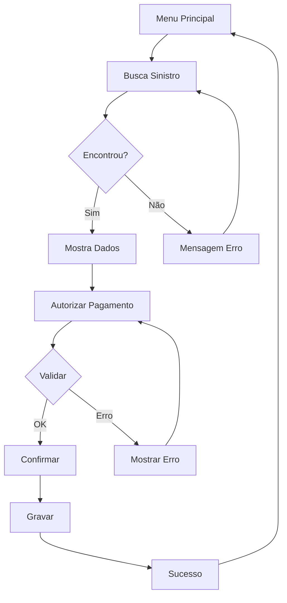

# 08 - Interface e Telas: Sistema Legado SIWEA

[← Voltar ao Índice](README.md) | [→ Próximo: Guia de Migração](09-migration-guide.md)

---

## Visão Geral da Interface

### Características do Terminal 3270

| Propriedade | Valor |
|-------------|--------|
| **Resolução** | 80 colunas × 24 linhas |
| **Caracteres** | EBCDIC |
| **Cores** | Verde sobre preto (monocromático) |
| **Navegação** | Teclado apenas (sem mouse) |
| **Atributos** | Normal, Bright, Hidden, Protected |
| **Teclas Função** | PF1-PF24 |

---

## Mapa de Navegação

```
                Menu Principal
                     SI00M000
                        │
        ┌───────────────┼───────────────┐
        │               │               │
    SI11M010        SI11M020        SI11M030
    Busca           Histórico       Relatórios
    Sinistro        Sinistro           │
        │               │               │
        └───────┬───────┘               │
                │                       │
            SIHM020                 SI11M040
          Autorização               Dashboard
           Pagamento                Gerencial
```

---

## Telas Detalhadas

### SI00M000 - Menu Principal

```
================================================================================
                    SIWEA - SISTEMA DE LIBERAÇÃO DE PAGAMENTOS                 
                              MENU PRINCIPAL                                   
================================================================================

    SELECIONE A OPÇÃO DESEJADA:

    1. BUSCAR SINISTRO............................ SI11M010
    2. CONSULTAR HISTÓRICO........................ SI11M020  
    3. AUTORIZAR PAGAMENTO....................... SIHM020
    4. RELATÓRIOS................................ SI11M030
    5. DASHBOARD GERENCIAL....................... SI11M040
    6. MANUTENÇÃO DE TABELAS.................... SI11M050
    7. CONFIGURAÇÕES............................ SI11M060
    8. SAIR DO SISTEMA.......................... 

    OPÇÃO: [ ]

    USUÁRIO: OPER001              TERMINAL: TERM01
    DATA: 27/10/2025              HORA: 14:35:22

================================================================================
 PF1=AJUDA  PF3=SAIR  PF12=CANCELAR  ENTER=CONFIRMAR
================================================================================
```

### SI11M010 - Busca de Sinistros

```
================================================================================
 SI11M010            BUSCA DE SINISTROS                        27/10/25 14:35
================================================================================

 INFORME UM DOS CRITÉRIOS DE BUSCA:

 1) BUSCA POR PROTOCOLO:
    FONTE....: [___]     (001-999)
    PROTOCOLO: [_______] (0000001-9999999)
    DAC......: [_]       (0-9)

 2) BUSCA POR NÚMERO DO SINISTRO:
    ORIGEM...: [__]      (01-99)
    RAMO.....: [__]      (01-50)
    NÚMERO...: [______]  (000001-999999)

 3) BUSCA POR CÓDIGO LÍDER:
    LÍDER....: [___]     (001-999)
    SINISTRO.: [_______] (0000001-9999999)

 MENSAGEM: _________________________________________________________________

================================================================================
 PF3=VOLTAR  PF5=LIMPAR  PF12=CANCELAR  ENTER=BUSCAR
================================================================================
```

### SIHM020 - Autorização de Pagamento

```
================================================================================
 SIHM020          AUTORIZAÇÃO DE PAGAMENTO                     27/10/25 14:40
================================================================================

 DADOS DO SINISTRO:
 ------------------
 PROTOCOLO.......: 001/0123456-7        STATUS........: ATIVO
 SINISTRO........: 10/20/789012         DATA ABERTURA.: 15/03/2025
 RAMO............: 20 - AUTOMÓVEIS      
 SEGURADO........: JOÃO SILVA SANTOS
 CPF/CNPJ........: 123.456.789-00
 
 VALORES:
 ---------
 RESERVA ESPERADA: R$    100.000,00
 TOTAL PAGO......: R$     40.000,00
 SALDO DISPONÍVEL: R$     60.000,00

 DADOS DA AUTORIZAÇÃO:
 ----------------------
 TIPO PAGAMENTO..: [_] (1-Total 2-Parcial 3-Complementar 4-Ajuste 5-Recalc)
 TIPO APÓLICE....: [_] (1-Individual 2-Coletiva)
 VALOR PRINCIPAL.: [___________,__]
 VALOR CORREÇÃO..: [___________,__] (Opcional)
 FAVORECIDO......: [__________________________________________________]
 
 TOTAL A PAGAR...:      0,00

================================================================================
 PF3=VOLTAR  PF6=CALCULAR  PF10=CONFIRMAR  PF12=CANCELAR  ENTER=VALIDAR
================================================================================
```

### SI11M020 - Histórico de Pagamentos

```
================================================================================
 SI11M020         HISTÓRICO DE PAGAMENTOS                      27/10/25 14:45
================================================================================
 SINISTRO: 10/20/789012                    PROTOCOLO: 001/0123456-7
 
 SEQ  DATA       HORA     TIPO  PRINCIPAL    CORREÇÃO     TOTAL      OPERADOR
 ---  ---------- -------- ----  ------------ ------------ ---------- --------
 001  15/03/2025 09:15:32  1    10.000,00    0,00         10.000,00  OPER001
 002  20/04/2025 14:22:15  2    15.000,00    500,00       15.500,00  OPER002
 003  10/05/2025 11:08:44  2    10.000,00    300,00       10.300,00  OPER001
 004  25/06/2025 16:55:21  3    5.000,00     200,00       5.200,00   OPER003
 
 
 
 
 
 TOTAL PAGO: R$ 40.000,00          SALDO: R$ 60.000,00
 
 PÁGINA 1 DE 1                                              
================================================================================
 PF3=VOLTAR  PF7=ANTERIOR  PF8=PRÓXIMA  PF11=IMPRIMIR  PF12=SAIR
================================================================================
```

### SI11M030 - Relatórios

```
================================================================================
 SI11M030              MENU DE RELATÓRIOS                      27/10/25 14:50
================================================================================

 SELECIONE O RELATÓRIO:

 1. [ ] PAGAMENTOS DO DIA
 2. [ ] PAGAMENTOS DO MÊS
 3. [ ] SINISTROS PENDENTES
 4. [ ] ANÁLISE POR RAMO
 5. [ ] ANÁLISE POR PRODUTO
 6. [ ] RELATÓRIO DE AUDITORIA
 7. [ ] ESTATÍSTICAS GERENCIAIS

 PARÂMETROS:
 ------------
 DATA INICIAL....: [__/__/____]
 DATA FINAL......: [__/__/____]
 RAMO............: [__] (Branco = Todos)
 PRODUTO.........: [____] (Branco = Todos)
 
 FORMATO.........: [_] (1-Tela 2-Impressora 3-Arquivo)
 
================================================================================
 PF3=VOLTAR  PF6=EXECUTAR  PF12=CANCELAR  ENTER=VALIDAR
================================================================================
```

---

## Fluxos de Navegação

### Fluxo de Busca e Autorização



---

## Atributos de Campos

### Tipos de Campos

| Tipo | Símbolo | Descrição | Input |
|------|---------|-----------|-------|
| Protected | `[texto]` | Apenas leitura | Não |
| Unprotected | `[____]` | Entrada de dados | Sim |
| Hidden | `[****]` | Senha/Oculto | Sim |
| Bright | `*texto*` | Destaque | Não |
| Normal | `texto` | Normal | Não |

### Validações de Campo

```
NUMERIC:     Apenas dígitos 0-9
ALPHA:       Apenas letras A-Z
ALPHANUMERIC: Letras e números
DECIMAL:     Números com vírgula
DATE:        DD/MM/AAAA
TIME:        HH:MM:SS
```

---

## Teclas de Função

### Mapeamento Global

| Tecla | Função | Disponível |
|-------|--------|------------|
| PF1 | Ajuda | Sempre |
| PF3 | Voltar/Sair | Sempre |
| PF5 | Limpar | Telas entrada |
| PF6 | Calcular | Quando aplicável |
| PF7 | Página Anterior | Listas |
| PF8 | Página Próxima | Listas |
| PF10 | Confirmar | Ações críticas |
| PF11 | Imprimir | Quando aplicável |
| PF12 | Cancelar | Sempre |
| ENTER | Validar/Próximo | Sempre |
| TAB | Próximo campo | Sempre |
| CLEAR | Limpar tela | Sempre |

---

## Mensagens do Sistema

### Tipos de Mensagem

```
INFORMAÇÃO: [I] Texto em branco
AVISO:      [A] Texto em amarelo  
ERRO:       [E] Texto em vermelho
SUCESSO:    [S] Texto em verde
```

### Mensagens Comuns

| Código | Tipo | Mensagem |
|--------|------|----------|
| I001 | Info | Processando, aguarde... |
| I002 | Info | Nenhum registro encontrado |
| S001 | Sucesso | Operação realizada com sucesso |
| S002 | Sucesso | Pagamento autorizado |
| A001 | Aviso | Valor próximo ao limite |
| A002 | Aviso | Sinistro com pendências |
| E001 | Erro | Sinistro não encontrado |
| E002 | Erro | Tipo de pagamento inválido |
| E003 | Erro | Valor principal obrigatório |
| E004 | Erro | Beneficiário obrigatório |

---

## Considerações para Migração Web

### Mapeamento Terminal → Web

| 3270 | Web Equivalent |
|------|---------------|
| Tela fixa 80x24 | Responsive layout |
| Campos protegidos | Readonly inputs |
| PF Keys | Buttons/Shortcuts |
| Tab navigation | Tab index |
| Green screen | Modern UI |
| EBCDIC | UTF-8 |

### Preservação de Funcionalidade

```javascript
// Simular teclas de função
document.addEventListener('keydown', (e) => {
    switch(e.key) {
        case 'F1': showHelp(); break;
        case 'F3': goBack(); break;
        case 'F5': clearForm(); break;
        case 'F12': 
        case 'Escape': cancel(); break;
        case 'Enter': validate(); break;
    }
});
```

### CSS para Preservar Layout

```css
/* Preservar estilo Site.css original */
.terminal-screen {
    max-width: 960px;
    font-family: 'Courier New', monospace;
    background: #000;
    color: #0f0;
}

.field-protected {
    background: transparent;
    border: none;
    color: #0f0;
}

.field-input {
    background: #000;
    border-bottom: 1px solid #0f0;
    color: #0ff;
}
```

---

*Este documento detalha todas as telas e interfaces do sistema SIWEA.*

**Última Atualização:** 27/10/2025
