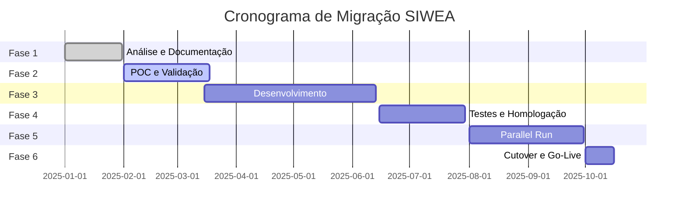

# 09 - Guia de Migração: SIWEA para .NET 9.0

[← Voltar ao Índice](README.md) | [→ Próximo: Glossário](10-glossary.md)

---

## Estratégia de Migração

### Abordagem Recomendada

**Tipo:** Big Bang com Parallel Run
**Duração Estimada:** 6 meses
**Risco:** Alto
**Complexidade:** Muito Alta

### Fases da Migração



---

## Mapeamento Tecnológico

### Stack Transformation

| Componente | De (Legado) | Para (Moderno) |
|------------|-------------|----------------|
| **Linguagem** | COBOL/EZEE | C# 13 |
| **Framework** | CICS | .NET 9.0 |
| **Frontend** | Terminal 3270 | React 19 + TypeScript |
| **Database** | DB2 z/OS | SQL Server 2022 |
| **API** | CICS Transaction | REST API + SOAP |
| **Messaging** | MQ Series | Azure Service Bus |
| **Cache** | In-memory | Redis |
| **Auth** | RACF | Azure AD + JWT |
| **Deploy** | Mainframe | Azure Kubernetes |

---

## Migração de Dados

### Estratégia ETL

```sql
-- 1. Extract from DB2
EXPORT TO tmestsin.csv OF DEL
SELECT * FROM TMESTSIN;

-- 2. Transform (Python script)
import pandas as pd
df = pd.read_csv('tmestsin.csv', encoding='cp500')
df['CREATED_AT'] = pd.to_datetime(df['CREATED_AT'])
df.to_sql('ClaimMaster', connection)

-- 3. Load to SQL Server
BULK INSERT ClaimMaster
FROM 'transformed_tmestsin.csv'
WITH (
    FIELDTERMINATOR = ',',
    ROWTERMINATOR = '\n',
    FIRSTROW = 2
);
```

### Volume de Dados

| Tabela | Registros | Tamanho | Tempo Est. |
|--------|-----------|---------|------------|
| TMESTSIN | 500K | 2 GB | 2 horas |
| THISTSIN | 2M | 8 GB | 6 horas |
| SI_ACOMPANHA | 1.5M | 3 GB | 3 horas |
| SI_SINISTRO_FASE | 800K | 1.5 GB | 2 horas |
| Outros | 500K | 2 GB | 2 horas |
| **TOTAL** | **5.3M** | **16.5 GB** | **15 horas** |

---

## Migração de Código

### COBOL para C#

#### Exemplo: Validação de Pagamento

**COBOL Original:**
```cobol
VALIDATE-PAYMENT-TYPE.
    IF WS-PAYMENT-TYPE < 1 OR WS-PAYMENT-TYPE > 5
        MOVE 'E0002' TO WS-ERROR-CODE
        MOVE 'Tipo de pagamento inválido' TO WS-ERROR-MSG
        PERFORM ERROR-EXIT
    END-IF.
    
CALCULATE-BTNF.
    MULTIPLY WS-PRINCIPAL BY WS-CONVERSION-RATE 
        GIVING WS-PRINCIPAL-BTNF ROUNDED.
    MULTIPLY WS-CORRECTION BY WS-CONVERSION-RATE
        GIVING WS-CORRECTION-BTNF ROUNDED.
    ADD WS-PRINCIPAL-BTNF WS-CORRECTION-BTNF
        GIVING WS-TOTAL-BTNF.
```

**C# Migrado:**
```csharp
public class PaymentValidator
{
    public void ValidatePaymentType(int paymentType)
    {
        if (paymentType < 1 || paymentType > 5)
        {
            throw new BusinessException("E0002", 
                "Tipo de pagamento inválido");
        }
    }
    
    public BTNFCalculation CalculateBTNF(
        decimal principal, 
        decimal correction, 
        decimal conversionRate)
    {
        return new BTNFCalculation
        {
            PrincipalBTNF = Math.Round(principal * conversionRate, 2),
            CorrectionBTNF = Math.Round(correction * conversionRate, 2),
            TotalBTNF = Math.Round((principal + correction) * conversionRate, 2)
        };
    }
}
```

---

## Migração de Telas

### Terminal 3270 para React

**Terminal Original:**
```
 TIPO PAGAMENTO..: [_] (1-Total 2-Parcial...)
 VALOR PRINCIPAL.: [___________,__]
```

**React Component:**
```tsx
const PaymentForm: React.FC = () => {
  const [paymentType, setPaymentType] = useState('');
  const [principalValue, setPrincipalValue] = useState('');

  return (
    <div className="terminal-screen">
      <div className="field-row">
        <label className="field-label">TIPO PAGAMENTO.:</label>
        <select 
          className="field-input"
          value={paymentType}
          onChange={(e) => setPaymentType(e.target.value)}
        >
          <option value="">Selecione...</option>
          <option value="1">1-Total</option>
          <option value="2">2-Parcial</option>
          <option value="3">3-Complementar</option>
          <option value="4">4-Ajuste</option>
          <option value="5">5-Recalculado</option>
        </select>
      </div>
      
      <div className="field-row">
        <label className="field-label">VALOR PRINCIPAL.:</label>
        <CurrencyInput
          className="field-input"
          value={principalValue}
          onValueChange={setPrincipalValue}
          decimalsLimit={2}
          prefix="R$ "
        />
      </div>
    </div>
  );
};
```

---

## Testes de Paridade

### Cenários Críticos

1. **Cálculo Financeiro**
   - Input: Valores conhecidos
   - Processo: Ambos sistemas
   - Comparar: Resultados devem ser idênticos

2. **Validação de Regras**
   - Testar todas 122 regras
   - Comparar mensagens de erro
   - Validar comportamento

3. **Performance**
   - Tempo de busca: < 3s (atual)
   - Autorização: < 90s (atual)
   - Carga: 200 usuários simultâneos

### Script de Teste

```python
import pytest
from legacy_api import LegacySystem
from new_api import NewSystem

class TestParity:
    def test_payment_calculation(self):
        # Arrange
        claim_data = {
            'principal': 50000.00,
            'correction': 2500.00,
            'conversion_rate': 1.0847
        }
        
        # Act
        legacy_result = LegacySystem.calculate(claim_data)
        new_result = NewSystem.calculate(claim_data)
        
        # Assert
        assert legacy_result['total_btnf'] == new_result['total_btnf']
        assert abs(legacy_result['total'] - new_result['total']) < 0.01
```

---

## Plano de Cutover

### Timeline Detalhado

```
D-30: Freeze de funcionalidades
D-14: Backup completo produção
D-7:  Deploy em staging
D-3:  Testes finais
D-1:  Comunicação usuários
D-0:  CUTOVER

00:00 - Stop legacy system
01:00 - Final backup
02:00 - Data migration start
06:00 - Data migration complete
07:00 - Validation checks
08:00 - System online (read-only)
09:00 - Full system online
10:00 - Monitor and support
```

### Rollback Plan

```bash
# Se falha detectada em até 4 horas
./rollback.sh --immediate

# Procedimento:
1. Stop new system
2. Restore legacy system
3. Replay transactions from log
4. Verify data integrity
5. Resume operations
```

---

## Treinamento

### Programa de Capacitação

| Audiência | Duração | Conteúdo | Formato |
|-----------|---------|----------|---------|
| Desenvolvedores | 40h | .NET, React, Azure | Presencial |
| Operadores | 16h | Nova interface | Hands-on |
| Suporte | 24h | Troubleshooting | Workshop |
| Gestores | 4h | Dashboard, KPIs | Apresentação |

### Material de Treinamento

1. **Manual do Usuário** (100 páginas)
2. **Guia de Referência Rápida** (10 páginas)
3. **Videos Tutoriais** (20 vídeos)
4. **Ambiente de Treinamento** (sandbox)
5. **FAQ** (50 perguntas comuns)

---

## Riscos e Mitigação

### Matriz de Riscos

| Risco | Probabilidade | Impacto | Mitigação |
|-------|---------------|---------|-----------|
| Perda de dados | Baixa | Crítico | Backups redundantes |
| Bug crítico | Média | Alto | Parallel run extended |
| Performance | Média | Alto | Load testing intensivo |
| Resistência usuários | Alta | Médio | Treinamento e suporte |
| Integração falha | Baixa | Alto | Modo contingência |

---

## Métricas de Sucesso

### KPIs da Migração

- [ ] 100% dos dados migrados com sucesso
- [ ] Zero perda de transações
- [ ] Performance igual ou melhor
- [ ] 95% satisfação dos usuários
- [ ] Redução 50% em incidentes
- [ ] ROI positivo em 18 meses

---

## Checklist Go-Live

### 1 Semana Antes

- [ ] Todos os testes passed
- [ ] Usuários treinados
- [ ] Backup plan testado
- [ ] Comunicação enviada
- [ ] Suporte escalado

### 1 Dia Antes

- [ ] Freeze produção
- [ ] Backup completo
- [ ] Scripts prontos
- [ ] War room setup
- [ ] Rollback testado

### Dia D

- [ ] Legacy stopped
- [ ] Data migrated
- [ ] System validated
- [ ] Users notified
- [ ] Monitoring active

---

*Este é o guia completo para migração do sistema SIWEA.*

**Última Atualização:** 27/10/2025
