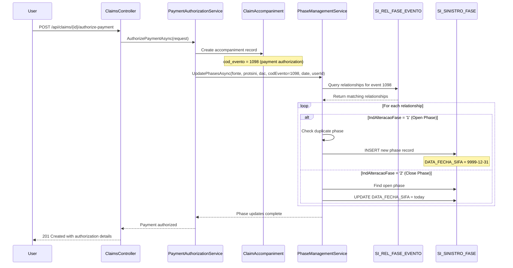

# Phase Management Workflow

**Feature**: 001-visualage-dotnet-migration | **Task**: T109
**Created**: 2025-10-23

## Overview

The Phase Management system tracks the lifecycle of claim phases automatically based on events recorded during claim processing. Phases can be in either **OPEN** or **CLOSED** status, indicated by the `DATA_FECHA_SIFA` field.

## Key Concepts

### Open Phase Marker

An **open phase** is indicated by:
```sql
DATA_FECHA_SIFA = '9999-12-31'
```

This SQL date maximum value serves as a sentinel to indicate an ongoing phase.

### Phase Event Relationships

Phase changes are driven by the `SI_REL_FASE_EVENTO` table, which defines:
- Which **phases** (CodFase) are affected by which **events** (CodEvento)
- Whether the event **opens** or **closes** the phase (IndAlteracaoFase: '1' = open, '2' = close)
- The **effective date range** (DataInivigRefaev) for the relationship

## Workflow Sequence Diagram



## Opening vs Closing Logic

### Opening a Phase

**Trigger**: Event with `IndAlteracaoFase = '1'` in SI_REL_FASE_EVENTO

**Process**:
1. Check if phase already exists (prevent duplicates)
2. If not exists, create new `ClaimPhase` record:
   ```csharp
   var newPhase = new ClaimPhase
   {
       Fonte = fonte,
       Protsini = protsini,
       Dac = dac,
       CodFase = codFase,
       CodEvento = codEvento,
       DataAberturaSifa = dataMovto,
       DataFechaSifa = new DateTime(9999, 12, 31), // Open marker
       CreatedBy = userId,
       CreatedAt = DateTime.UtcNow
   };
   ```

**SQL Example**:
```sql
INSERT INTO SI_SINISTRO_FASE (
    FONTE, PROTSINI, DAC, COD_FASE, COD_EVENTO,
    NUM_OCORR_SINIACO, DATA_INIVIG_REFAEV,
    DATA_ABERTURA_SIFA, DATA_FECHA_SIFA,
    CREATED_BY, CREATED_AT
) VALUES (
    1, 123456, 7, 10, 1098,
    0, '2025-01-01',
    '2025-10-23', '9999-12-31',
    'user.id', GETDATE()
);
```

### Closing a Phase

**Trigger**: Event with `IndAlteracaoFase = '2'` in SI_REL_FASE_EVENTO

**Process**:
1. Find the open phase (WHERE DATA_FECHA_SIFA = '9999-12-31')
2. Update `DataFechaSifa` to closing date:
   ```csharp
   var openPhase = await FindOpenPhaseAsync(fonte, protsini, dac, codFase, codEvento);
   if (openPhase != null)
   {
       openPhase.DataFechaSifa = dataMovto;
       openPhase.UpdatedBy = userId;
       openPhase.UpdatedAt = DateTime.UtcNow;
       await UpdateAsync(openPhase);
   }
   ```

**SQL Example**:
```sql
UPDATE SI_SINISTRO_FASE
SET DATA_FECHA_SIFA = '2025-10-25',
    UPDATED_BY = 'user.id',
    UPDATED_AT = GETDATE()
WHERE FONTE = 1
  AND PROTSINI = 123456
  AND DAC = 7
  AND COD_FASE = 10
  AND COD_EVENTO = 1098
  AND DATA_FECHA_SIFA = '9999-12-31';
```

## Event Codes and Phase Impacts

### Common Event Codes

| Event Code | Description | Typical Action |
|------------|-------------|----------------|
| 1098 | Payment Authorization | Opens payment phase |
| 2001 | Document Submission | Opens documentation phase |
| 2002 | Document Approval | Closes documentation phase |
| 3001 | External Validation Started | Opens validation phase |
| 3002 | External Validation Completed | Closes validation phase |
| 9001 | Claim Finalization | Closes all open phases |

### Example: Payment Authorization Event (1098)

**SI_REL_FASE_EVENTO Configuration**:
```sql
-- Opens "Payment Processing" phase
INSERT INTO SI_REL_FASE_EVENTO (COD_FASE, COD_EVENTO, DATA_INIVIG_REFAEV, IND_ALTERACAO_FASE)
VALUES (10, 1098, '2024-01-01', '1');

-- Closes "Pending Documentation" phase
INSERT INTO SI_REL_FASE_EVENTO (COD_FASE, COD_EVENTO, DATA_INIVIG_REFAEV, IND_ALTERACAO_FASE)
VALUES (5, 1098, '2024-01-01', '2');
```

**Result**: When payment authorization occurs:
1. Phase 10 (Payment Processing) opens
2. Phase 5 (Pending Documentation) closes

## Computed Properties

### IsOpen
```csharp
public bool IsOpen => DataFechaSifa == new DateTime(9999, 12, 31);
```

### DaysOpen
```csharp
public int DaysOpen
{
    get
    {
        var endDate = IsOpen ? DateTime.Today : DataFechaSifa;
        return (endDate - DataAberturaSifa.Date).Days;
    }
}
```

## API Integration

### Get Claim Phases

**Endpoint**: `GET /api/claims/{fonte}/{protsini}/{dac}/phases`

**Response Example**:
```json
{
  "sucesso": true,
  "protocolo": "001/0123456-7",
  "totalFases": 3,
  "fases": [
    {
      "codFase": 10,
      "nomeFase": "Processamento de Pagamento",
      "codEvento": 1098,
      "nomeEvento": "Autorização de Pagamento",
      "numOcorrSiniaco": 1,
      "dataInivigRefaev": "2024-01-01T00:00:00Z",
      "dataAberturaSifa": "2025-10-23T00:00:00Z",
      "dataFechaSifa": "9999-12-31T00:00:00Z",
      "isOpen": true,
      "status": "Aberta",
      "diasAberta": 0,
      "dataAberturaFormatada": "23/10/2025",
      "dataFechaFormatada": "Em Aberto",
      "durationColorCode": "green"
    },
    {
      "codFase": 5,
      "nomeFase": "Documentação Pendente",
      "codEvento": 1098,
      "nomeEvento": "Autorização de Pagamento",
      "numOcorrSiniaco": 1,
      "dataInivigRefaev": "2024-01-01T00:00:00Z",
      "dataAberturaSifa": "2025-10-15T00:00:00Z",
      "dataFechaSifa": "2025-10-23T00:00:00Z",
      "isOpen": false,
      "status": "Fechada",
      "diasAberta": 8,
      "dataAberturaFormatada": "15/10/2025",
      "dataFechaFormatada": "23/10/2025",
      "durationColorCode": "green"
    }
  ]
}
```

## SQL Queries for Manual Checks

### Check Phase State
```sql
SELECT
    FONTE,
    PROTSINI,
    DAC,
    COD_FASE,
    COD_EVENTO,
    DATA_ABERTURA_SIFA,
    DATA_FECHA_SIFA,
    CASE
        WHEN DATA_FECHA_SIFA = '9999-12-31' THEN 'Aberta'
        ELSE 'Fechada'
    END AS Status,
    CASE
        WHEN DATA_FECHA_SIFA = '9999-12-31'
        THEN DATEDIFF(DAY, DATA_ABERTURA_SIFA, GETDATE())
        ELSE DATEDIFF(DAY, DATA_ABERTURA_SIFA, DATA_FECHA_SIFA)
    END AS DiasAberta
FROM SI_SINISTRO_FASE
WHERE FONTE = 1 AND PROTSINI = 123456 AND DAC = 7
ORDER BY DATA_ABERTURA_SIFA DESC;
```

### Find Open Phases
```sql
SELECT *
FROM SI_SINISTRO_FASE
WHERE DATA_FECHA_SIFA = '9999-12-31'
ORDER BY DATA_ABERTURA_SIFA;
```

### Check Event-Phase Relationships
```sql
SELECT
    r.COD_FASE,
    r.COD_EVENTO,
    r.DATA_INIVIG_REFAEV,
    r.IND_ALTERACAO_FASE,
    CASE r.IND_ALTERACAO_FASE
        WHEN '1' THEN 'Abertura'
        WHEN '2' THEN 'Fechamento'
        ELSE 'Desconhecido'
    END AS Acao
FROM SI_REL_FASE_EVENTO r
WHERE r.COD_EVENTO = 1098
  AND r.DATA_INIVIG_REFAEV <= GETDATE()
ORDER BY r.COD_FASE;
```

## Transaction Management

Phase updates are **part of the payment authorization transaction**. If any step fails, the entire transaction rolls back:

```csharp
using (var transaction = await _unitOfWork.BeginTransactionAsync())
{
    try
    {
        // 1. Create claim history record
        await _unitOfWork.ClaimHistories.AddAsync(history);

        // 2. Update claim master totals
        claim.Totpag += valtotbt;
        claim.Ocorhist++;
        await _unitOfWork.Claims.UpdateAsync(claim);

        // 3. Create accompaniment record
        await _unitOfWork.ClaimAccompaniments.AddAsync(accompaniment);

        // 4. Update phases (T098)
        await _phaseManagementService.UpdatePhasesAsync(
            fonte, protsini, dac, codEvento, dataMovto, userId);

        // 5. Commit all changes atomically
        await transaction.CommitAsync();
    }
    catch (Exception)
    {
        await transaction.RollbackAsync();
        throw;
    }
}
```

This ensures data consistency: **all or nothing** (FR-030).

## Testing

### Unit Tests
```bash
dotnet test --filter "FullyQualifiedName~PhaseManagementServiceTests"
```

### Integration Tests
```bash
dotnet test --filter "FullyQualifiedName~PhaseManagementIntegrationTests"
```

### E2E Test Scenario
1. Authorize payment for claim
2. Verify phase opening in SI_SINISTRO_FASE (DATA_FECHA_SIFA = 9999-12-31)
3. Trigger closing event
4. Verify phase closed (DATA_FECHA_SIFA = today)

## Troubleshooting

### Issue: Phase not opening/closing
**Check**:
1. SI_REL_FASE_EVENTO has relationship for the event
2. `DATA_INIVIG_REFAEV` <= current date
3. `IND_ALTERACAO_FASE` is '1' (open) or '2' (close)
4. No duplicate open phases (for opening)
5. Open phase exists (for closing)

### Issue: Duplicate phases created
**Solution**: The `PreventDuplicatePhase` method checks for existing open phases before creating new ones.

### Issue: Transaction rollback
**Check**: Phase service logs for exceptions during UpdatePhasesAsync

## References

- **Specification**: `/specs/001-visualage-dotnet-migration/spec.md` (FR-025 to FR-030)
- **Implementation**: `/backend/src/CaixaSeguradora.Infrastructure/Services/PhaseManagementService.cs`
- **API Endpoint**: `/backend/src/CaixaSeguradora.Api/Controllers/ClaimsController.cs` (GET /phases)
- **Database Schema**: `/specs/001-visualage-dotnet-migration/data-model.md` (ClaimPhase entity)
