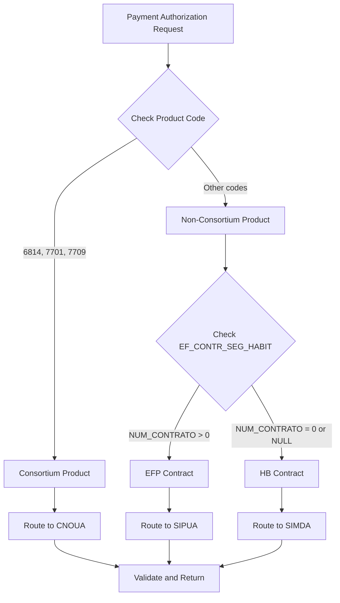

# Product Validation Routing Logic

**Feature**: 001-visualage-dotnet-migration | **Task**: T094
**Created**: 2025-10-23

## Overview

This document describes the product validation routing logic for the Claims System. When processing payment authorizations, the system routes validation requests to different external services based on product codes and contract types.

## Routing Decision Tree



## Product Codes and Routing Rules

### 1. Consortium Products (CNOUA Validation)

**Product Codes**: 6814, 7701, 7709

**Validation Service**: CNOUA (Consórcio Nacional de Ouvidoria das Administradoras)

**Endpoint**: `{CNOUA_BASE_URL}/validate`

**Request Payload**:
```json
{
  "claimId": 12345,
  "productCode": "6814",
  "policyNumber": "001/0123456",
  "contractNumber": "CON-2024-001",
  "amount": 25000.00,
  "currencyCode": "BRL"
}
```

**Success Response** (EZERT8 = '00000000'):
```json
{
  "status": "APPROVED",
  "ezert8Code": "00000000",
  "validatedAt": "2025-10-23T14:30:00Z",
  "responseTimeMs": 1250
}
```

**Error Codes**:
- `EZERT8001`: Contrato de consórcio inválido
- `EZERT8002`: Contrato cancelado
- `EZERT8003`: Grupo encerrado
- `EZERT8004`: Cota não contemplada
- `EZERT8005`: Beneficiário não autorizado

### 2. EFP Contracts (SIPUA Validation)

**Determination**: Query `EF_CONTR_SEG_HABIT` table
- If `NUM_CONTRATO > 0`, route to SIPUA

**Validation Service**: SIPUA (Sistema Integrado de Pagamento e Uniformização de Apólices)

**Protocol**: SOAP

**WSDL**: `{SIPUA_BASE_URL}/services/validation?wsdl`

**SOAP Request Example**:
```xml
<soapenv:Envelope xmlns:soapenv="http://schemas.xmlsoap.org/soap/envelope/"
                  xmlns:val="http://sipua.validation.caixa.com.br">
   <soapenv:Header/>
   <soapenv:Body>
      <val:ValidateEFPContract>
         <val:contractNumber>12345</val:contractNumber>
         <val:policyNumber>001/0123456-7</val:policyNumber>
         <val:amount>10000.00</val:amount>
      </val:ValidateEFPContract>
   </soapenv:Body>
</soapenv:Envelope>
```

**Success Response**:
```xml
<soap:Envelope>
   <soap:Body>
      <ValidateEFPContractResponse>
         <status>APPROVED</status>
         <validationCode>VAL-OK-001</validationCode>
      </ValidateEFPContractResponse>
   </soap:Body>
</soap:Envelope>
```

### 3. HB Contracts (SIMDA Validation)

**Determination**: Query `EF_CONTR_SEG_HABIT` table
- If `NUM_CONTRATO = 0` or NOT FOUND, route to SIMDA

**Validation Service**: SIMDA (Sistema de Monitoramento e Dados de Apólices)

**Protocol**: SOAP

**WSDL**: `{SIMDA_BASE_URL}/services/validation?wsdl`

**SOAP Request Example**:
```xml
<soapenv:Envelope xmlns:soapenv="http://schemas.xmlsoap.org/soap/envelope/"
                  xmlns:val="http://simda.validation.caixa.com.br">
   <soapenv:Header/>
   <soapenv:Body>
      <val:ValidateHBContract>
         <val:claimNumber>001/0023456/001</val:claimNumber>
         <val:beneficiaryTaxId>12345678901</val:beneficiaryTaxId>
         <val:amount>5000.00</val:amount>
      </val:ValidateHBContract>
   </soapenv:Body>
</soapenv:Envelope>
```

## Implementation Details

### Code Location

**Service**: `PaymentAuthorizationService.cs`
```csharp
private IEnumerable<IExternalValidationService> DetermineRequiredValidationServices(string productCode)
{
    // Check if consortium product
    if (IsConsortiumProduct(productCode))
    {
        return _validationServices.Where(s => s.SystemName == "CNOUA");
    }

    // Check EF_CONTR_SEG_HABIT for EFP/HB routing
    var contractInfo = await _unitOfWork.ConsortiumContracts.GetByPolicyAsync(policyNumber);

    if (contractInfo?.NumContrato > 0)
    {
        return _validationServices.Where(s => s.SystemName == "SIPUA");
    }

    return _validationServices.Where(s => s.SystemName == "SIMDA");
}
```

### Error Handling

All external validation services implement **circuit breaker pattern** with:
- **Retry Policy**: 3 attempts with exponential backoff (2s, 4s, 8s)
- **Circuit Breaker**: Opens after 5 consecutive failures, break duration 30s
- **Timeout**: 10 seconds per request

**Error Response Mapping**:
```csharp
if (response.Status == "ERROR" || response.EZERT8 != "00000000")
{
    return new ValidationResult
    {
        Status = "REJECTED",
        Message = MapExternalErrorCode(response.EZERT8),
        SystemName = "CNOUA"
    };
}
```

## Testing Strategy

### Unit Tests
```bash
dotnet test --filter "FullyQualifiedName~ProductValidatorTests"
```

### Integration Tests
```bash
dotnet test --filter "FullyQualifiedName~ConsortiumProductIntegrationTests"
```

### Manual Testing

**Test Case 1: Consortium Product (6814)**
```bash
curl -X POST https://localhost:5001/api/claims/1/1/1/12345/authorize-payment \
  -H "Content-Type: application/json" \
  -d '{
    "tipoPagamento": 1,
    "valorPrincipal": 10000.00,
    "favorecido": "Test User",
    "tipoApolice": "1",
    "productCode": "6814"
  }'
```

Expected: CNOUA validation called

**Test Case 2: EFP Contract**
- Ensure `NUM_CONTRATO > 0` in EF_CONTR_SEG_HABIT
- Expected: SIPUA validation called

**Test Case 3: HB Contract**
- Ensure `NUM_CONTRATO = 0` or not in EF_CONTR_SEG_HABIT
- Expected: SIMDA validation called

## Configuration

### appsettings.json
```json
{
  "ExternalServices": {
    "CNOUA": {
      "BaseUrl": "https://cnoua.validation.service",
      "Timeout": 10,
      "RetryCount": 3
    },
    "SIPUA": {
      "BaseUrl": "https://sipua.validation.service",
      "Timeout": 10,
      "RetryCount": 3
    },
    "SIMDA": {
      "BaseUrl": "https://simda.validation.service",
      "Timeout": 10,
      "RetryCount": 3
    }
  }
}
```

## Monitoring and Logging

All validation requests are logged with:
- Request ID (correlation ID)
- Product code
- Routing decision
- External service name
- Response time
- Status (success/failure)

**Example Log Entry**:
```
[INFO] Payment authorization 1098 for claim 12345 routed to CNOUA (product: 6814)
[INFO] CNOUA validation completed in 1250ms - Status: APPROVED
```

## Troubleshooting

### Issue: Validation always fails
- **Check**: External service base URL in configuration
- **Check**: Network connectivity to external services
- **Check**: Circuit breaker state (may be open after failures)

### Issue: Wrong service called
- **Check**: Product code in request
- **Check**: EF_CONTR_SEG_HABIT table data for contract numbers
- **Check**: IsConsortiumProduct logic in ProductValidator

### Issue: Timeout errors
- **Check**: External service response time (should be < 10s)
- **Check**: Network latency
- **Solution**: Increase timeout in configuration (max 30s recommended)

## References

- **Specification**: `/specs/001-visualage-dotnet-migration/spec.md` (FR-020 to FR-024)
- **Implementation**: `/backend/src/CaixaSeguradora.Infrastructure/Services/PaymentAuthorizationService.cs`
- **Validators**: `/backend/src/CaixaSeguradora.Core/Validators/ProductValidator.cs`
- **External Clients**: `/backend/src/CaixaSeguradora.Infrastructure/ExternalServices/`
